# L'installation

J'utilise l'environnement Quartus II Web Edition V11.1 service pack 1 et ModelSim-Altera Starter Edition. 

Le transfert du bitmap vers le FPGA se fait en utilisant un clone chinois de l'USB Byte Blaster. Les drivers sont situés dans le répertoire `<Path to Quartus II installation>\drivers\<cable type>`.

La seule configuration consiste à indiquer quel outil de simulation on souhaite utiliser. Pour ce faire, utiliser le menu `<tools>/<options>` et renseigner la ligne intitulée "ModelSim-Altera" :

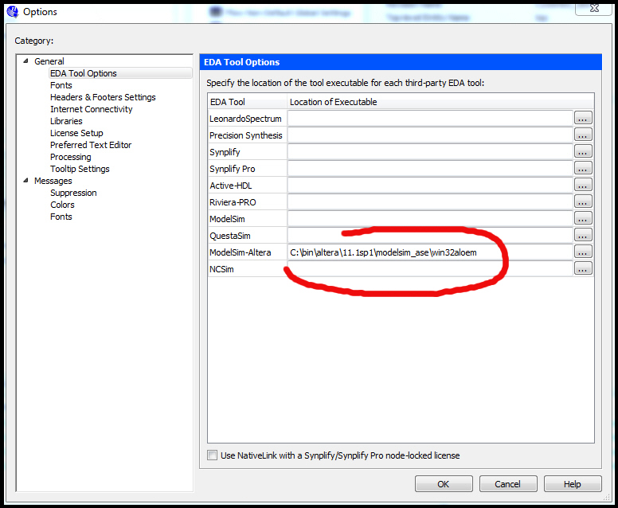


# Un bref tutoriel

## Le système cible

Le système consiste en un compteur 32 bits alimenté par une horloge à 18.75MHz obtenue par multiplication par 3/8 de l'horloge de la carte EP2C5 à 50MHz. L'état des bits 24, 25 et 26 du compteur sera visualisé par les 3 leds de la carte à EP2C5.

La PLL est un macro-composant généré par le Macrowizard de Quartus II. Le compteur est un modèle VHDL.

Voici un schéma du système, généré par Quartus. On peut difficilement faire plus simple.

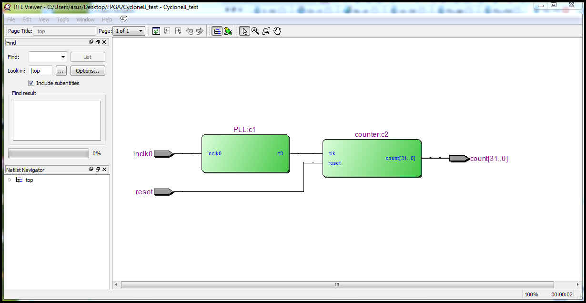


## La carte

La carte que j'utilise comprend un FPGA Cyclone II EP2C5T144 d'Altera. En voici une photo : 


Cette carte comprend le strict minimum, à savoir :
- le FPGA lui-même,
- les connecteurs JTAG (chargement de la RAM du FPGA) et Active Serial (chargement de la flash de configuration)
- une flash de configuration de 4Mbits  ([http://www.alldatasheet.com/datasheet-pdf/pdf/392941/ALTERA/EPCS4SI8.html EPCS4SI8])
- un régulateur 1.2V (tension du coeur)
- un régulateur 3.3V (I/O)
- 3 leds rouges connectées aux broches 3, 7 et 9
- une led rouge témoin d'alimentation
- un interrupteur connecté à la masse et à la broche 144
- un oscillateur 50MHz connecté à la broche 17.

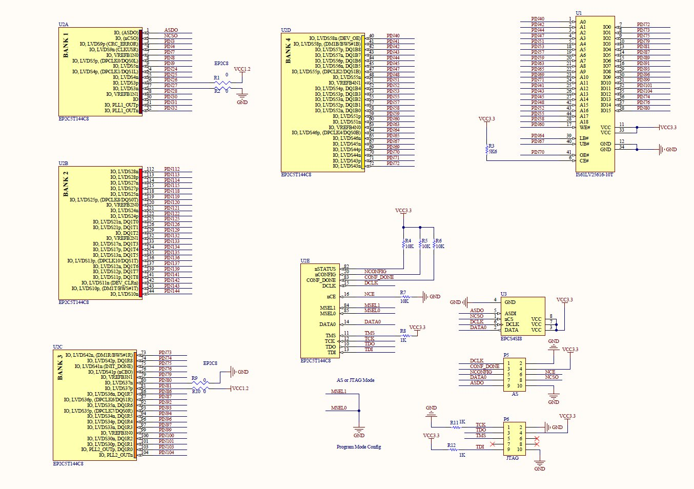
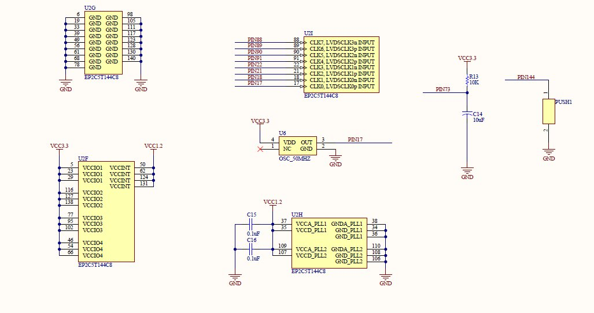
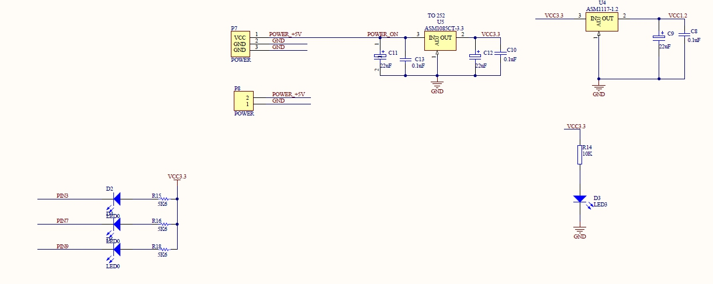


## La création du projet

Lancement du "wizard" : File/New Project Wizard

- Page 1 : on donne le nom du projet ("hello") et nom de l'entité de plus haut niveau ("top") :

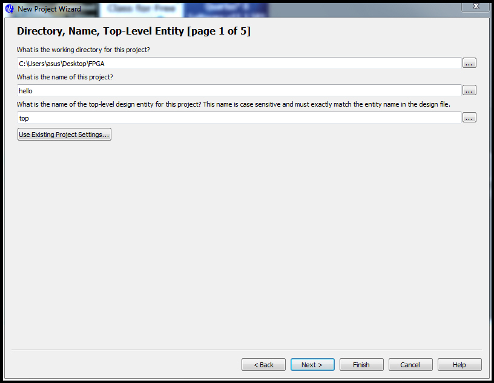

- Page 2 : on laisse la page vide. Les fichiers seront rajoutés plus tard.

- Page 3 : sélection du composant. Il s'agit d'un CycloneII de 144 broches : l'EP2C5T144C8  

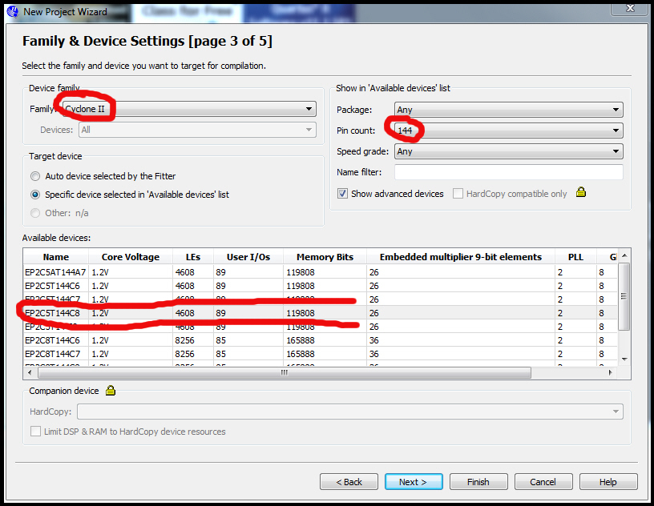
    
    Ce composant est alimenté en 1.2V, dispose de 4608 logical elements (LE), de 89 broches d'IO, de 119808 bits de RAM,de 26 multiplicateurs de 9 bits et de 2 PLL (nous en utiliserons une).
- Page 4 : sélection des outils. On précise simplement que l'on utilisera le simulateur ModelSim-Altera. 

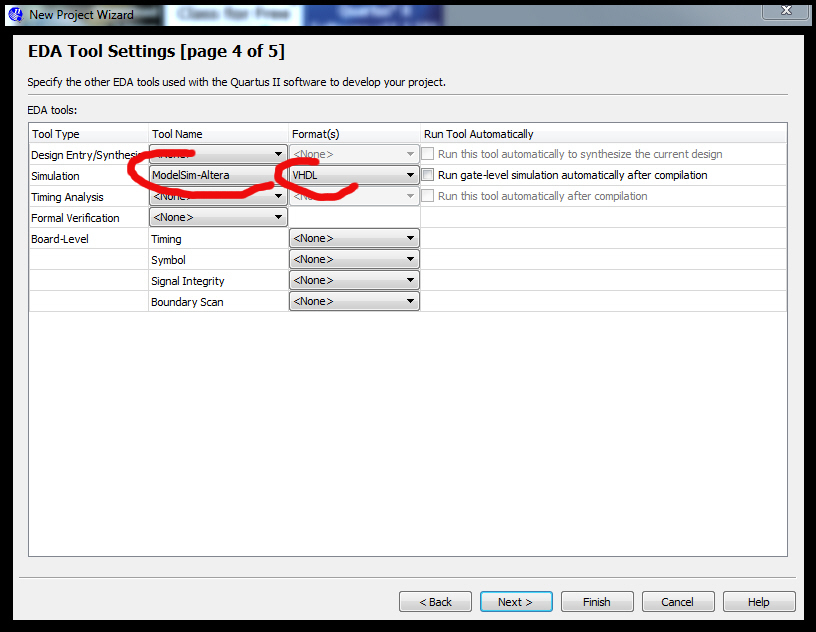

- Page 5 : résumé de la configuration du projet.

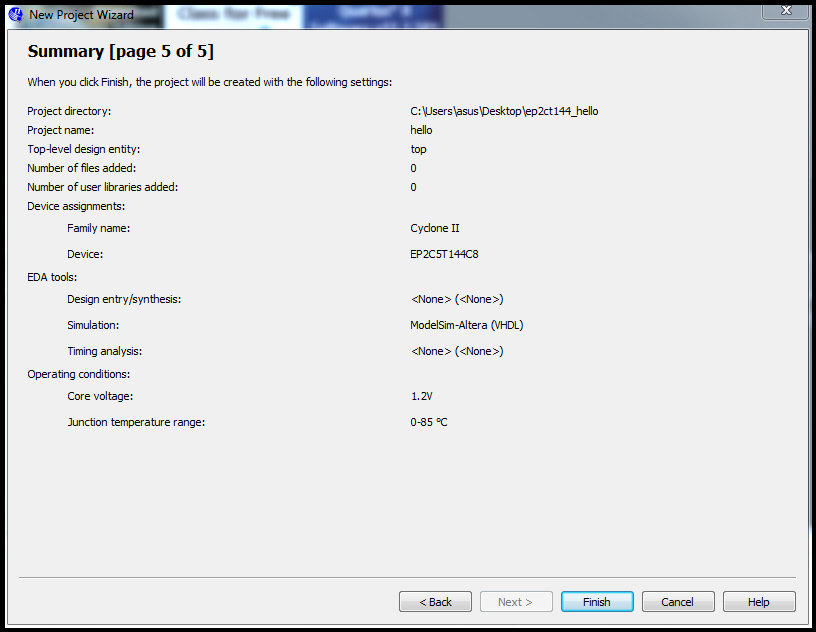

Une fois le projet créé, la page principale de QuartusII s'ouvre. Le navigateur de projet (vue "hierarchy") indique le nom du composant et le nom de l'entité de plus haut niveau (ici : "top"). Les vues "files" et "Design Units" sont pour l'instant vides.

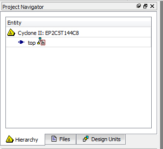

## Création du modèle VHDL

### Création du compteur
Nous allons tout d'abord créer le compteur.

Nous créons un nouveau fichier à l'aide du menu `<file>/<new>/<VHDL file>`.

Dans la fenêtre nouvellement créée, on recopie le code VHDL suivant : 
```
 library IEEE;
 use IEEE.STD_LOGIC_1164.all;

 entity counter is
 	port (count : buffer STD_LOGIC_VECTOR(31 downto 0) :="00000000000000000000000000000000";
 			clk   : in STD_LOGIC;
 			reset : in STD_LOGIC);
 end;
 
 architecture arch1 of counter is
 	-- Les données de timing ne sont utilisées que pour la simulation.
 	constant tpd_reset_to_count : time := 10 ns;
 	constant tpd_clk_to_count   : time :=  5 ns;
 
 	function increment(val : STD_LOGIC_VECTOR) return STD_LOGIC_VECTOR
 	is
 		-- normalize the indexing
 		alias input : STD_LOGIC_VECTOR(val'length downto 1) is val;
 		variable result : STD_LOGIC_VECTOR(input'range) := input;
 		variable carry : STD_LOGIC := '1';
 	begin
 		for i in input'low to input'high loop
 			result(i) := input(i) xor carry;
 			carry := input(i) and carry;
 			exit when carry = '0';
 		end loop;
 		return result;
 	end increment;
 begin
 	ctr:
 	process(clk)
 	begin
 		if (clk = '1') then
 			count <= increment(count) after tpd_clk_to_count;
 		end if;
 				--if (reset = '1') then
 			--	count <= (others => '0') after tpd_reset_to_count;
 		--end if;
 	end process;
 end arch1;
```

Puis on sauvegarde le fichier (ctrl-S) sous le nom "counter.vhdl".

## Création de la PLL

La PLL est un macro-composant fournit par Altera. Il est créé à l'aide de l'outil `<Tools>/<Megawizard plug-in manager>` :

- Page 1 : Choix de l'action. Ici, on cherche à créer un nouveau composant. On sélectionnera donc la première option ("Create a new custom megafunction variation").
- Page 2a : Choix de la mega-fonction à créer. Ici, on choisit `<Installed plug-ins>/<IO>/<ALTPLL>`. Le nom du fichier VHDL à générer doit être indiqué. Ici, on utilise le nom "pll".

 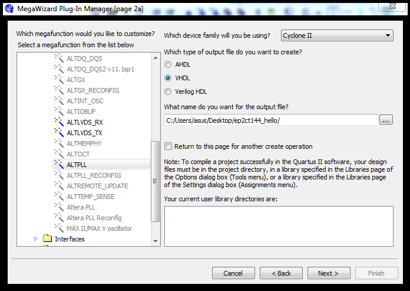 

- Page 3 : Configuration générale de la PLL. Sur cette page, on indique la fréquence d'entrée de la PL, soit 50MHz dans notre cas.

 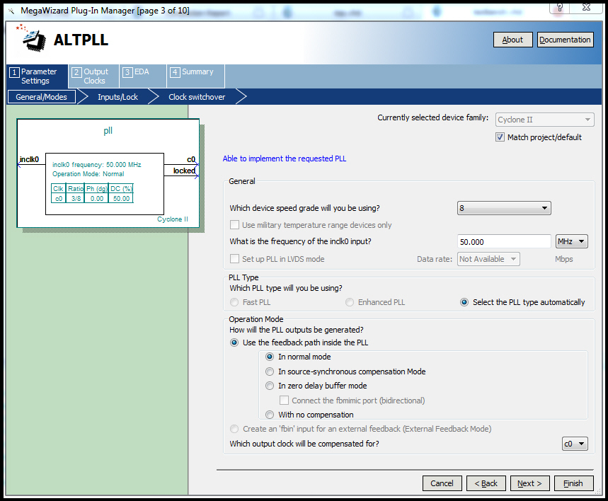

- Page 4 : Choix des entrées/sorties de la PLL. Dans notre exemple, on se contente de générer la sortie "Locked" qui indique si la PLL est "locked" ou non. On décoche donc la case "Create an 'areset' input...".

 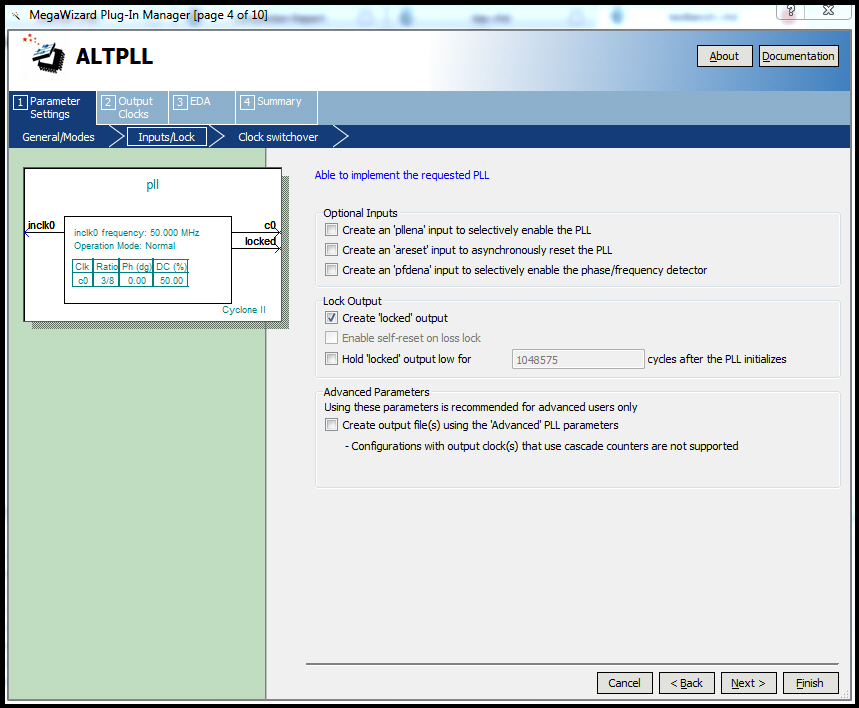

- Page 5 : Clock switchover. On ne modifie rien.
- Page 6 : Configuration de la fréquence de sortie. Dans notre exemple, on multiplie la fréquence d'horloge d'entrée par 3/8 (multiplication par 3 et division par 8) 

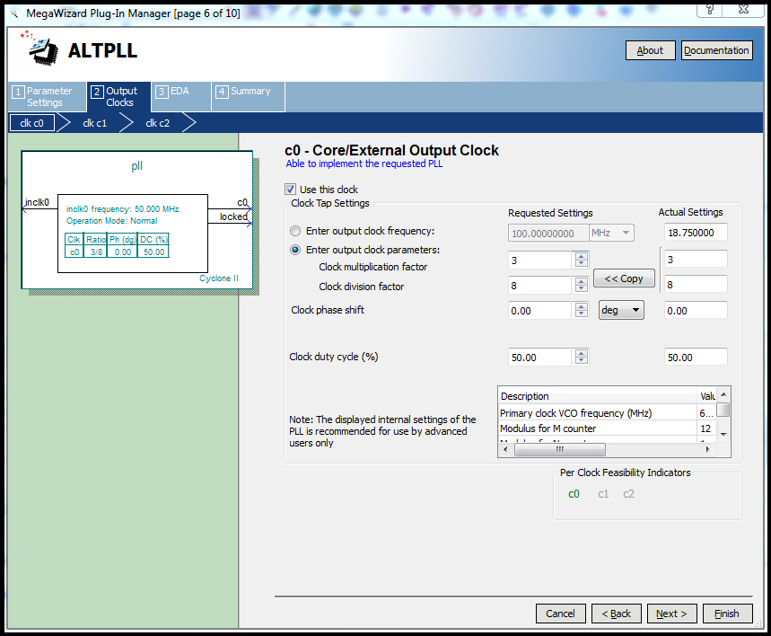

- Page 7 à 9 : On ignore (cliquer sur NEXT)
- Page 10 : Récapitulatif et choix des fichiers à générer. Dans notre exemple, on génère tous les fichiers (cocher toutes les cases).

 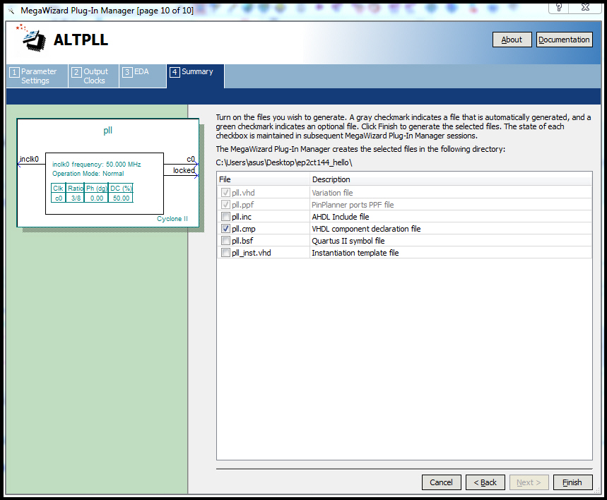

Cliquer sur "Finish" pour terminer le processus. Une boite de dialogue s'affiche vous demandant si vous souhaitez que le fichier IP Quartus II soit inclus dans le projet. Répondre "Yes". 

Une fois cette opération réalisée,la vue "Files" du navigateur de projet doit désormais contenir deux éléments : l'un représentant le compteur et l'autre la PLL : 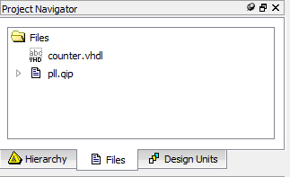

==Création de l'entité de plus haut niveau : top==
Lors de la création du projet, nous avons indiqué que l'entité de plus haut niveau s'appellera "top". C'est d'ailleurs la seul entité présentée dans la vue "hierarchy" pour l'instant.

Cette entité n'existe pas. Nous allons la créer : `<file>/<new>/<VHDL file>`. Dans la fenêtre d'édition, on recopie le code suivant :
```
 library IEEE;
 use IEEE.STD_LOGIC_1164.all;
 
 entity top is
 	port(	inclk0	: IN STD_LOGIC  := '0';
 			count : buffer STD_LOGIC_VECTOR(31 downto 0);
 			reset	: IN STD_LOGIC  := '0');
 end;
 architecture arch1 of top is
 	component pll
 		port(	inclk0	: IN STD_LOGIC  := '0';
 				c0			: OUT STD_LOGIC ;
 				locked	: OUT STD_LOGIC );
 	end component;
 	component counter
 		port (count : buffer STD_LOGIC_VECTOR(31 downto 0);
 				clk   : in STD_LOGIC;
 				reset : in STD_LOGIC);
 	end component;
 	signal clock : STD_LOGIC;
 	signal locked: STD_LOGIC;
 begin	
 	c1: pll port map ( inclk0,clock,locked);
 	c2: counter port map (count,clock,reset);	
 end arch1;
```

Puis on sauvegarde le fichier sous le nom "top.vhd".

## Compilation du design

A ce stade des opérations, notre design est complet. Nous pouvons le "compiler" en utilisant la commande `<Processing>/<Start compilation>` ou `Ctrl-L`.

Si tout ce passe bien, les étapes de compilation s'effectuent en séquence. Ces étapes sont décrites dans la fenêtre "Tasks" :

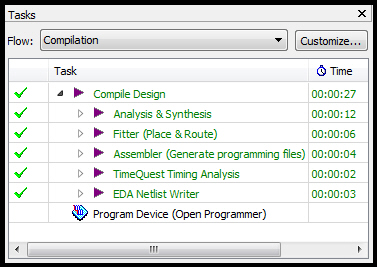

L'outil produit un résumé indiquant, notamment, le nombre d'éléments logiques utilisés, le nombre de multiplicateurs utilisées, etc.

Désormais, le navigateur indique l'ensemble des entités et architectures créées dans le projet :

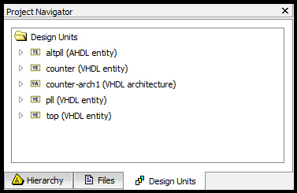

## Génération du test bench

Pour pouvoir vérifier le bon comportement de notre "design", nous souhaitons le simuler.

Dans cet exemple, j'utilise VHDL pour décrire l'environnement de simulation (appelé "test bench" dans VHDL). Ce test bench est lui aussi décrit en VHDL, comme le système lui-même. Cependant, contrairement à ce dernier, il n'a pas à être synthétisé : tous les éléments de VHDL sont utilisables. Notamment, les "wait for XX ns" qui vont nous servir à créer le signal d'horloge en entrée de la PLL. 

On créé donc un nouveau fichier VHDL que l'on appellera "test_bench". On y recopie le code VHDL suivant :
```
 library IEEE;
 use IEEE.STD_LOGIC_1164.all;
 
 entity testbench is
 end;
 
 architecture arch1 of testbench is
 component top
 	port(	inclk0	: IN STD_LOGIC  := '0';
 			count : buffer STD_LOGIC_VECTOR(31 downto 0) :="00000000000000000000000000000000";
 			reset: IN STD_LOGIC  := '0');
 end component;
 signal clock : STD_LOGIC;
 signal reset : STD_LOGIC;
 signal count : STD_LOGIC_VECTOR(31 downto 0);
 begin
 	-- Generation d'une fréquence de 50MHz (période = 20ns) 
 	process
 	begin	
 		wait for 10 ns;
 		clock <= '0' ;
 		wait for 10 ns;
 		clock <= '1' ;
 	end process;
 	eut: top port map ( clock, count, '0');
 end arch1;
```

Une fois l'entité "test_bench" créée, on indique à Quartus II que c'est cette entité qu'il faudra instancier lors d'une simulation. Pour ce faire, on utilise le menu "settings" (bouton droit sur le projet "Cyclone II..." dans la fenêtre de navigation).

Dans la fenêtre correspondant à la sélection "EDA Tool Settings / Simulation", on trouve une ligne intitulée "Compile test bench".

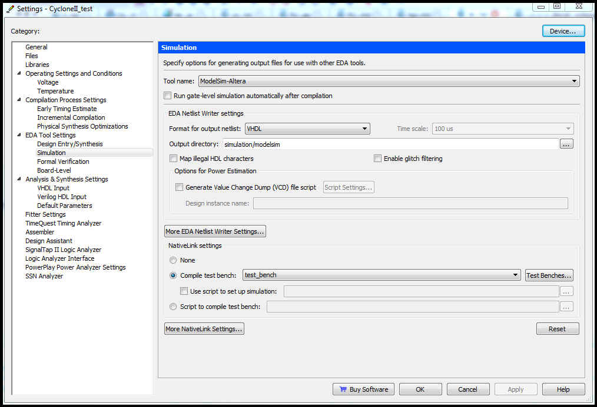 

En cliquant sur "Test Benches", on fait apparaître la liste des test benches déjà définis. Cette liste est vide. En cliquant sur "New...", l'outil propose la création d'un nouveau test bench. On lui donne le nom "testbench", comme indiqué dans la copie d'écran ci-après. On indique ne outre quel fichier VHDL contient le test bench. Dans notre cas, il s'agit du fichier "testbench.vhd".

Au final, la fenêtre de saisie doit ressembler à celle-ci : 

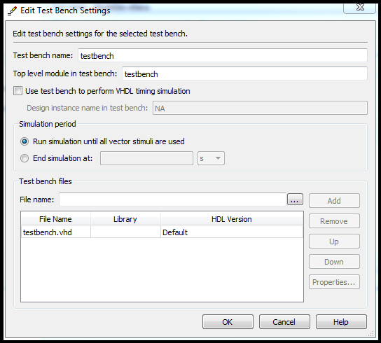

et la fenêtre contenant la liste des test benches à celle-ci :

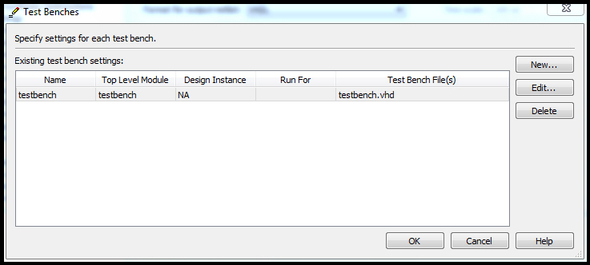

## Simulation du design

Une fois le test bench créé, la simulation du système s'effectue via la commande `<tools>/<Run Simulation Too>/<RTL Simulation>`.

Le simulateur ModelSim se lance et exécute le test bench.

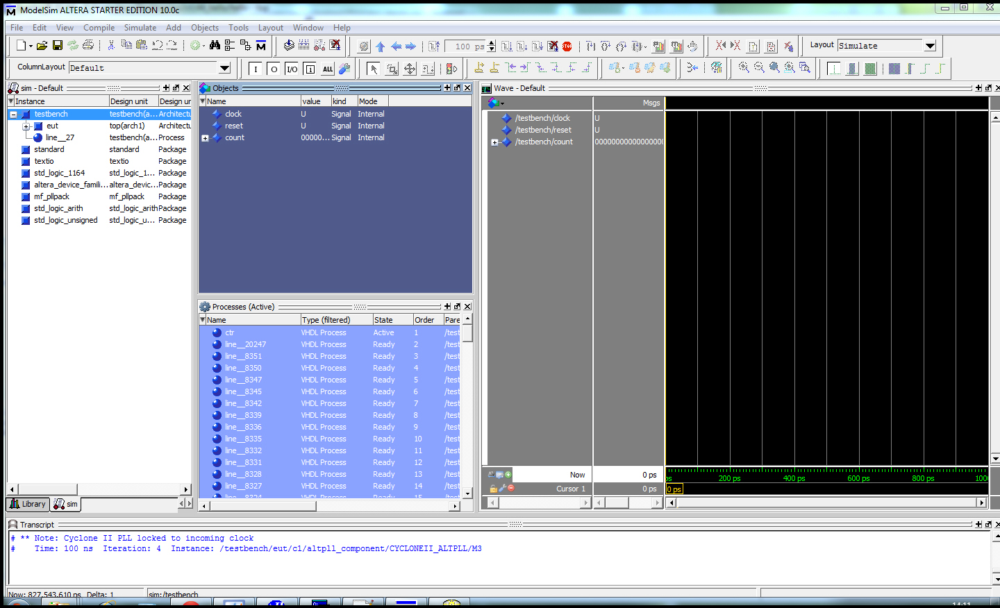

L'écran est découpé en trois parties principales : 
- La partie gauche donne la liste des éléments du modèle. Le "testbench" est le premier d'entre-eux.
- La partie centrale donne le nom des "objets" (les signaux) et des processus du modèle.
- La partie droite donne le chronogramme des signaux. On peut rajouter un signal en utilisant le "drag'n'drop".

La simulation est soit lancée automatiquement (normalement c'est la cas) soit lancée manuellement via le menu `<simulate>`.
On peut exécuter la simulation pendant une certaine durée si l'outil ci-dessous.

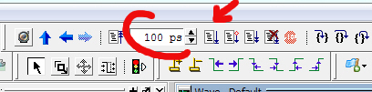

Le chronogramme décrit l'évolution de l'état des signaux.

## Configuration des broches
La mise en correspondance des broches et des signaux VHDL s'effectue au moyen de l'outil `<Assignments>/<Pin planner>` ou de `<Assignments>/<Assignment Editor>`. J'utilise ici le premier.

L'outil affiche l'ensemble des signaux VHDL non affectés. Il suffit alors de leur attribuer une broche. Dans notre cas :
- les signaux count 21, 22 et 23 sont attribués aux broches 9, 7 et 3 (connectées à des LEDs rouges sur la carte) ;
- le signaux inclk0 est attribué à la broche 17(connectée à l'oscillateur à 50MHz).

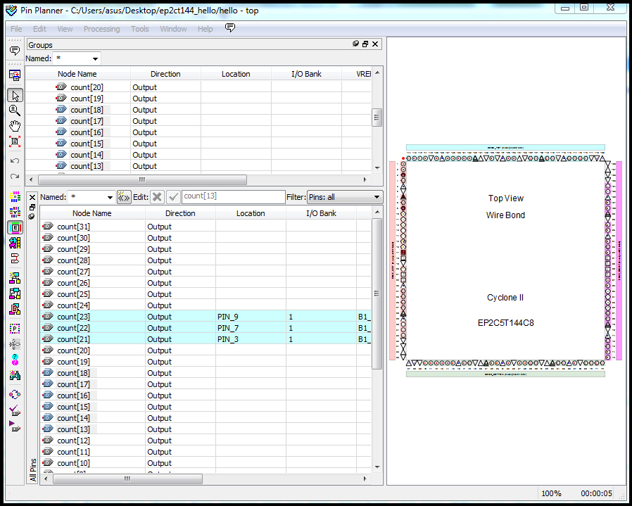

Une fois l'affectation faite, on lance l'analyse par le menu `<Processing>/<Start I/O Assignment Analysis>`.

## Programmation du FPGA

### Programmation JTAG

La programmation s'effectue via le menu `<Tools>/<Programmer>`. En phase de mise au point, on utilise la programmation JTAG qui charge le programme dans la RAM du FPGA. Pour une programmation en flash, il faut utiliser la programmation "Active Serial Programming". Le mode de programmation est sélectionné via le menu déroulant "Mode". Il faut en outre que le connecteur de l'USB Blaster soit branché sur la prise "AS" de la carte...

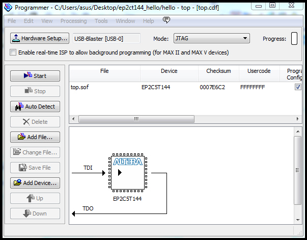

### Programmation Active Serial

La programmation s'effectue via le menu `<Tools>/<Programmer>`. On choisit le mode "Active Serial Programming". Il faut alors choisir le périphérique EPCS4 qui est la flash 8Mb installée sur la carte.

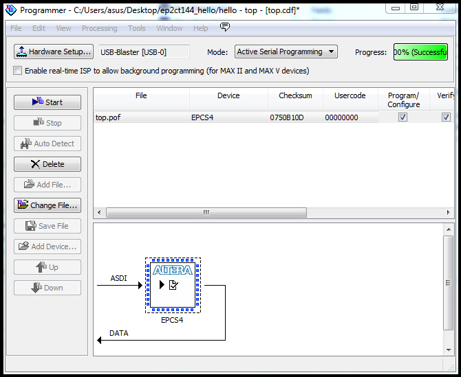