# Experimentations en 2011

## 29/12/2011
- Je viens de faire mes première armes sur un [[FPGA Altera CycloneII EP2C5T44]] : quelques lignes de VHDL et 3 leds qui clignotent. En gros, un "Hello world" en version FPGA. On trouvera quelques notes sur le sujet sur la page dédiée à cette carte.

## 27/12/2011
- J'ai connecté le DSPIC sur mon écran VGA. Ca marchotte : je n'arrive pas à obtenir une très grande (voire même une grande tout court) résolution mais je parviens à afficher une image stable :

 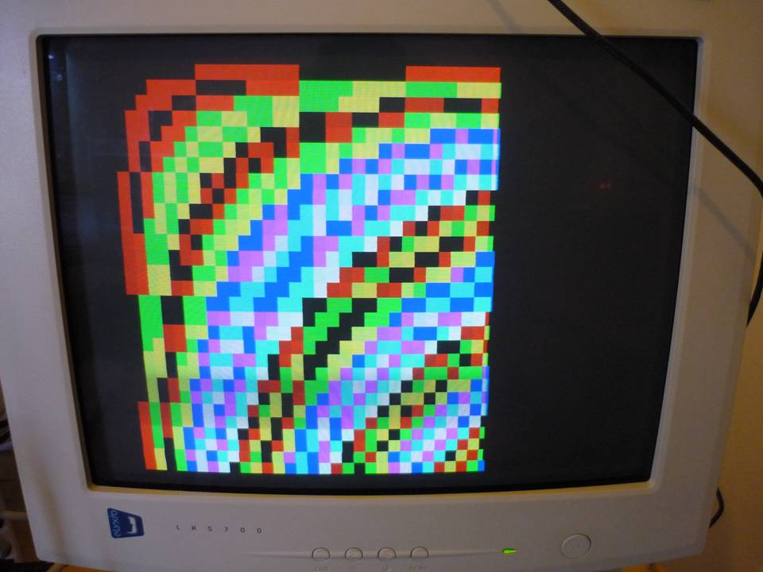
 
- J'ai encore de sérieux soucis avec l'échantillonnage de l'image. Les investigations sont en cours. Au passage, je rappelle qu'il faut éviter d'utiliser PORTx en sortie ; il faut utiliser LATx.
- Je me suis remis à VHDL. L'objectif est de faire une espèce de "carte graphique" avec un petit FPGA, histoire de décharger le pauvre DSPIC qui a un peu de mal à gérer à la fois l'affichage et l'acquisition vidéo.

## 21/12/2011
- Pas de progrès considérable sur ma carte [[acquisition directe du signal vidéo issu d'une caméra analogique N&B]]. J'ai simplement modifié les routines d'IT pour échantillonner une image de 32x32 points.
- Je vais maintenant faire le petit bout de logiciel qui permettra l'affichage de l'image en question sur un écran VGA (résolution cible : 640x480).
- Les signaux de synchro sont directement issus du microcontrôleur. Les signaux de couleur (Red Green Blue) sont obtenus via un CNA trivial utilisant 2 résistances (R et 2R). Vu le nombre de bits, je n'utilise pas un réseau type R/2R mais un réseau type 2^IxR. Le calcul de R est simple : lorsque les 2 bits sont à 1, la tension doit être de 0.7V au plus, sachant que la prise VGA côté moniteur présente une impédance de 75 ohm vers la masse. Si Req est la résistance équivalente à R et 2R en parallèle, on a donc 1/Req = 1/R + 1/2R d'où Req = 2R/3. La tension aux bornes de la résistance de 75 ohm est donc U=75x(5 / (2R/3+75))<=0.7v d'où R>=690 ohm. On prendra la valeur la plus proche de la gamme habituelle.
- La résolution est faible pour deux raisons : le DSPic n'a que peu de mémoire (4Kb) et son ADC, s'il est assez rapide (1MSPS), ne l'est pas suffisamment pour échantillonner 640 points par ligne! (En gros, une ligne dure 64us, en prenant le signal de synchro et le préambule. Pour obtenir 640 points il faut une durée maximale d'échantillonnage de 64us / 640 = 100ns, soit 10 fois plus que ce que peut faire l'ADC (sans compter qu'il faut aussi quelques instructions pour lire et écrire les données).
- Aussi, je pense utiliser un FPGA bas-de-gamme pour échantillonner le signal de la caméra, écrire les données dans une RAM externe (pourquoi pas de la SDRAM, pour changer?), générer le signal vidéo VGA, et gérer l'accès du DSPIc à la RAM video (le FPGA sera vu comme une mémorie par le PIC). Le DSPic pourra alors se "concentrer" sur le traitement de l'image. Je vas utiliser un FPGA Cyclone II d'Altera. A suivre...

## 15/12/2011
- J'ai reçu ma [[carte eZDSP de Texas Instruments]] ($49 via FedEx, port compris...). Premières compilations...

## 11/12/2011
- Bon, j'ai terminé la carte d'odométrie par [[souris PS/2]]. Oh ! elle comprend un coupleur CAN... La voila :

 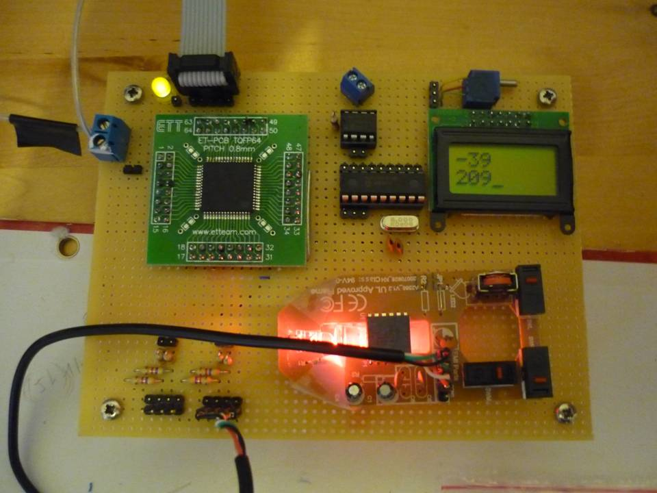

- J'ai achevé la première partie de ma carte d'acquisition vidéo à dsPIC. Pas plus de 50 lignes de code ; essentiellement des initialisations et deux routines d'interruption. Je dois pouvoir parvenir à environ 100 échantillons (pixels) sur une ligne, sans avoir besoin d'échantillonner plusieurs images en décalant le t0 d'échantillonnage ligne. L'article [[acquisition directe du signal vidéo issu d'une caméra analogique N&B]] contient quelques photos qui donnent une idée du résultat.

## 28/11/2011
- Il est temps de se remettre à l'acquisition vidéo. Histoire de compléter un peu ma maigre culture sur le sujet, je vais tenter l'[[acquisition directe du signal vidéo issu d'une caméra analogique N&B]]. Dans le principe, c'est très simple : il ne s'agit que d'échantillonner le signal vidéo et de le convertir en valeur numérique. La difficulté consiste à trouver un ADC suffisamment rapide.
- Pour ma part, j'adopte une autre stratégie : j'échantillonne une même ligne plusieurs fois en décalant le t0 de départ. Ca n'autorise évidemment pas une définition très bonne, mais c'est économique.
- Pour me faciliter la tâche, je vais utiliser un LM1881 pour détecter les débuts de lignes, débuts d'images.

## 22/11/2011
- J'ai réalisé un petit montage pour acquérir les données de déplacement et de position boutons d'une souris PS/2. On trouvera (tôt ou tard) une petite synthèse du protocole PS/2 dans la rubrique [[Souris PS/2]]. L'objectif est d'utiliser deux souris (la partie capteur positionnée face à la roue) pour mesurer la rotation de chacune des roues. C'est une alternative simple à la mise en place d'un encodeur optique (que j'expérimenterai sans doute plus tard). C'est aussi assez économique dans la mesure où une souris optique coûte environ 5 euros.
- Actuellement, je parviens à configurer la souris et à obtenir les informations de déplacement sur requête. Ce mode (dit "remote") n'est pas le mode standard d'une souris qui fonctionne normalement en mode "streaming" (elle envoie les données de déplacement et de position bouton lorsqu'elles changent), mais comme je ne dispose pas de SPI sur un PIC (et que je ne dispose pas de 2 SPI sur un Atmega), je fais du "bit-banging". Pour éviter de perdre des données, il faut donc que les transferts de données soient synchronisés avec les activités du microcontroleur.
- J'ai de sérieux problèmes avec les "fusibles" de l'Atmega32 qui changent de façon intempestive, ce qui conduit dans la plupart des cas à ne plus pouvoir communiquer avec le programmateur. Je ne comprends pas pourquoi car (i) il y une détection du brown-out et (ii) je prends soin de faire un reset manuel avant toute extinction / allumage de l'alimentation.
- Je vais sans doute me lancer dans la réalisation d'un robot hexapode. Première étape : en chiffrer le coût minimal (coût des servos et de la batterie), sachant qu'il faut 18 servos assez costaud.

## 20/11/2011
- J'ai rajouté un moyen de positionnement absolu du "radar" de mon robot. Il s'agit d'un petit photo interrupteur KTIR0811S de Kingbright doublé d'un détecteur de seuil à ampli-op LM358. La chose me permettra de repositionner automatiquement le radar lors du démarrage du robot. Voila une photo du petit montage.

 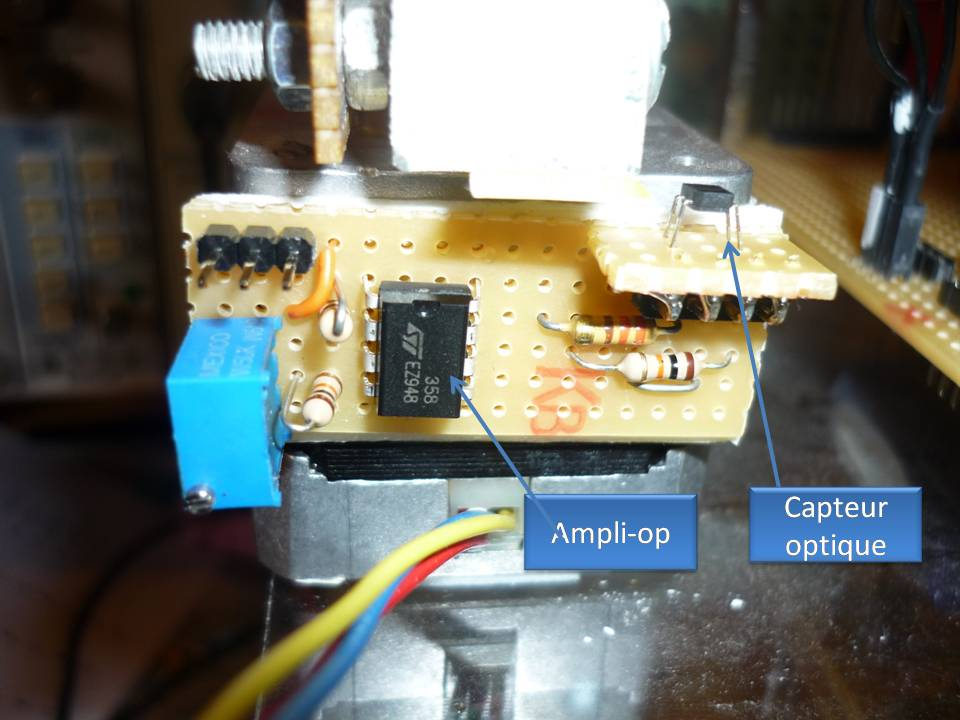

- La robot en question est désormais capable de se déplacer, de déterminer la direction qui présente l'obstacle le plus lointain, de prendre et de suivre le cap (magnétique) correspondant.
- J'ai fait deux petites cartes à base d'Atmega64. Voir les notes "à retenir" pour éviter les pièges de ce circuit.

## 29/10/2011

- J'ai rajouté une petite rubrique "musiques" (à gauche). Un p'tit coup de "Master Of Puppets" suivi de quelques minutes de Jarrousky... Woooooooouuuawww. Le Sauna Suédois.
- J'ai terminé le boitier d'affichage/contrôle (que j'appelle pompeusement "télémétrie" voire même [[petit boitier de TM/TC]] pour les lunaires). Il est désormais possible de communiquer avec la Chose par radio au moyen du merveilleux nRF24L01. Je recommande vivement à tout un chacun de saupoudrer ses montages avec ce petit chip ridiculement pas cher (et sur SPI).
- Au fait : j'ai renoncé à faire dire "Bonjour Maître" à la Chose (un peu à la façon de la créature de Shelley) : trop compliqué, la bestiole ne parlant qu'anglais. Et mal.
- En voici une photo (c'est fou ce que mes montages se ressemblent, vu de l'extérieur) :

 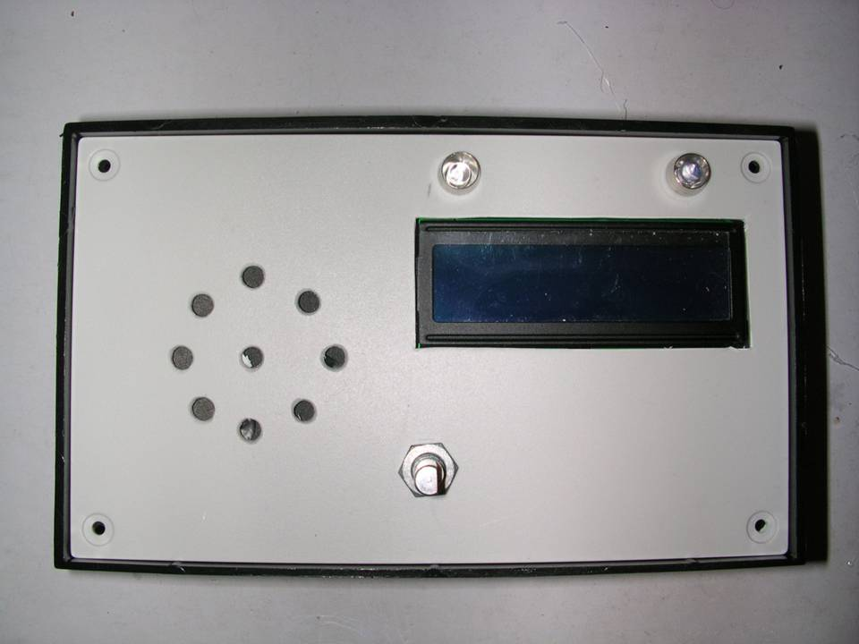

## 18/10/2011

- J'ai simplement intégré l'EEPROM 24LC256 au montage et y ai transféré le dictionnaire du Speakjet. Il me reste désormais à piloter le nRF24L01 (et à faire une petite carte avec un autre nRF24L01 pour pouvoir les faire communiquer entre eux...).
- J'ai commandé une petite carte ($20) permettant de lire et d'écrire sur des périphériques RFID type MIFARE/ISO14443A à 13.56MHz. On trouve divers chips pilotes RFID sur le net pour quelques euros... dont le MFRC522 de ma carte. A noter que ce dernier est impossible à souder soi-même.

## 09/10/2011

- Pratiquement un mois sans nouvelle... Je ne trouve pas le temps...
- Je suis en train d'achever la réalisation d'un petit montage qui permettra au (futur et bien hypothétique) robot de communiquer avec le reste du monde. Il s'agit un boitier regroupant un classique afficheur, un synthétiseur vocal (SpeakJet, voir la note du 28/08), un petit rotacteur, ainsi qu'un chip radio. Voici la chose à la date d'aujourd'hui :

    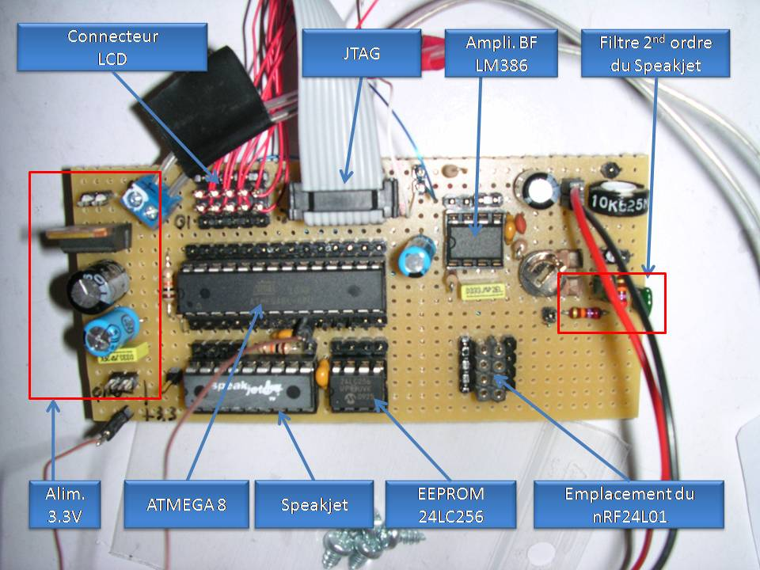
    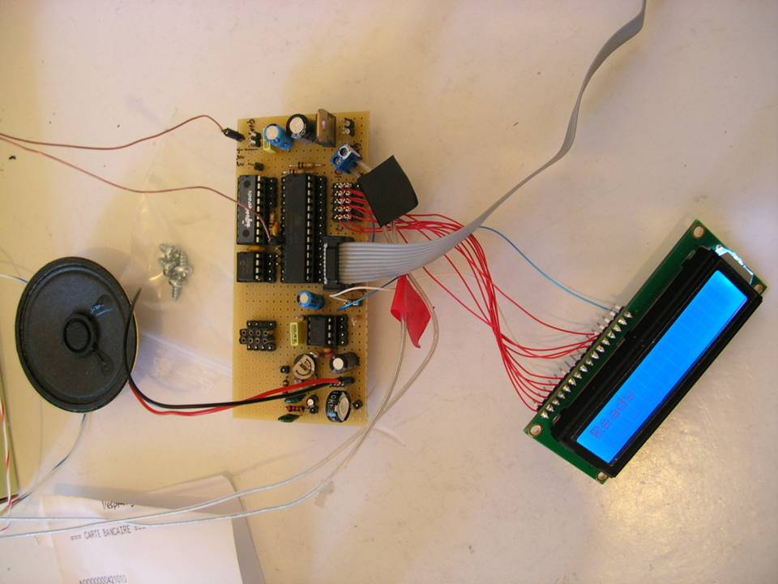

- Le synthétiseur vocal fonctionne, même s'il faut avoir l'oreille fine. J'ai récupéré le petit dictionnaire de 1400 mots (traduction en phonèmes) qui est fourni par Magnevation. Je vais le transférer sur l'EEPROM de 32K (24LC256) que j'ai intégrée à la carte.
- La communication s'effectuera à l'aide d'un nRF24L01, un chip utilisé pour les souris et autres périphériques sans fil (composant à $3...). En voici une image : 

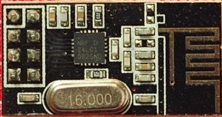

## 12/09/2011

- Pas grand chose ces derniers temps, rentrée oblige.
- J'ai vaguement bricolé le détecteur de radiation à base de diode PIN BPW28 proposée par Elektor. Il me reste désormais à trouver 5kg de tritium pour le tester...
- J'ai reçu les [[batteries LIPO]] et le chargeur adapté. Je vais pouvoir poursuivre un peu le développement de [[Trobot1]], après avoir flané ici et là.
- J'ai fait le tout petit bout de soft Java qui me permet de recevoir et visualiser les images produites par ma [[caméra OV7670]]. J'ai eu quelques soucis pour communiquer via le Bluetooth (vu comme un port série sur le PC) : le buffer n'est jamais vraiment vide... Désormais, le synchronise le PC avec la carte en émettant une séquence d'entiers (1,2,...,32) qui est détectée par le soft côté pour se resynchroniser. Ceci dit, les images sont toujours mauvaises... et je ne parviens pas à trouver l'origine du problème. Peut-être est-ce lié à la mauvaise qualité de l'horloge utilisée par la caméra pour écrire dans la RAM d'échange...

## 28/08/2011

- Je fais vraiment n'importe quoi... la preuve : je viens de faire un (tout) petit [[dictaphone à base de APR9600]]. Ca ne sert à rien ; je n'ai rien inventé... c'est plus ou moins aussi stimulant intellectuellement que de regarder la télé. Voici la chose :
 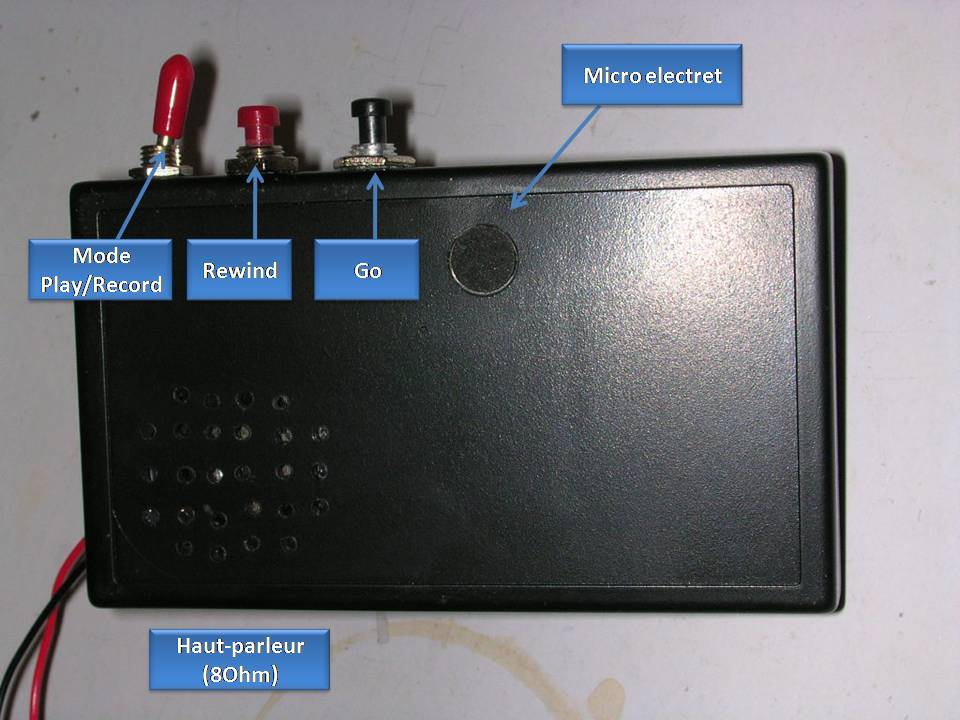

- J'ai reçu le chip [speakjet](http://www.magnevation.com/) que j'avais commandé il y a de cela quelques semaines (chez [SpeechChips](http://www.speechchips.com)). Ce composant permet de réaliser une synthèse vocale par phonèmes. La qualité n'est pas géniale si j'en crois les extraits que l'on trouve sur Internet, mais il ne coûte pas trop cher. (Ca me rappelle le synthétiseur que j'avais acheté pour mon Oric 1, il y a de cela 30 ans... ce dernier utilisait le SP0256 de General Instruments. Un jour, j'essayerai de le récupérer pour voir). Le Speakjet possède un petit compagnon qui permet d'effectuer la conversion d'un texte (en anglais) en liste de phonèmes. Je ne l'ai pas acheté : je compte sur le logiciel que l'on trouve chez Magnevation pour faire cette conversion.
- Je vais devoir me faire un programmateur de flash I2C/SPI pour pouvoir tranquillement stocker et mettre à jour le texte que je compte faire prononcer par le Speakjet.

## 21/08/2011

- Je considère avoir plus ou moins terminé mon [[lecteur MP3 à base de PIC32MX]] : l'utilisateur peut désormais sélectionner une station de radio à partir d'une liste préchargée (à partir de la SDCARD).
- Par un mauvais coup du sort, le lecteur de MP3 est redevenu erratique... je ne comprends pas vraiment ce qui se passe et espère que la lumière jaillira un jour ou l'autre. Je vais passer à autre chose.
- Voici un gros plan de la carte de décodage MP3/Tuner FM :

 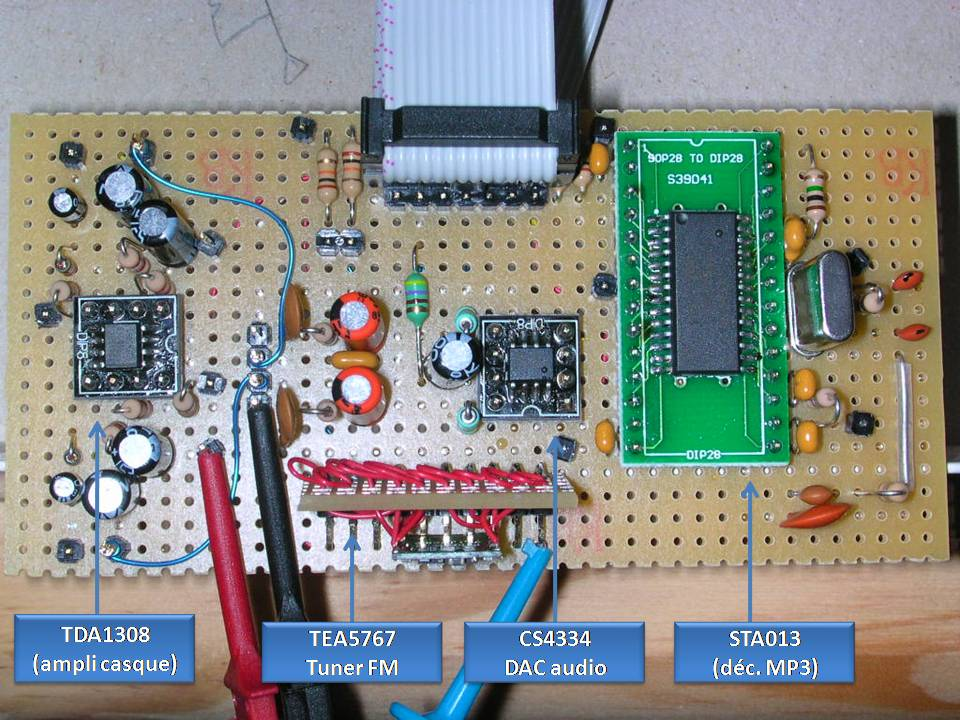

- J'ai complété la rubrique correspondante pour donner quelques informations sur la réalisation, notamment au niveau logiciel (utilisation de la bibliothèque graphique de Microchip, notamment).

## 17/08/2011

- Retour maison après un bref séjour à Florence et ses 10^6 touristes.
- Le [[lecteur MP3 à base de PIC32MX]] est désormais muni de la radio FM (enfin presque), grâce à l'adjonction d'un TEA5767-qui-fait-tout-l'boulot. Cette petite chose à $3 offre une radio FM à PLL complète avec recherche automatique des stations. Tout ça sur I2C.
- Pour l'instant, je n'ai fait que brancher la chose, faire une recherche et obtenir --- Ô miracle --- France-Infos. Il me reste à réaliser le bout de logiciel qui permettra à l'utilisateur de choisir la station qu'il veut écouter.
- Après avoir changé 3 fois de capas, 2 fois de quartz,... j'ai enfin réussi à faire fonctionner proprement le lecteur MP3 pendant plus de 5 minutes (voir billets précédents). Il ne s'agissait pas d'un problème d'horloge mais d'un problème concernant le signal qui indique au PIC qu'il faut transmettre des données. L'ajout d'une résistance de pull-up de 1MOhm (oui..., bizarre, bizarre) sur ce signal semble avoir résolu le problème. J'avoue n'y rien comprendre car ce signal n'est pas "collecteur ouvert"... Arf.
- Prochains montages :
  - un "compteur Geiger" à base de diode BPW34. Il s'agit d'un montage proposé par Elektor (numéro de Juin 2011).
  - une matrice de 8x8x8 LEDs (chercher "cube led" sur youtube, il y en a tout un tas...)
  - un synthétiseur vocal à base de [SpeakJet](http://www.magnevation.com)
  - etc.

## 06/08/2011

- J'ai réalisé un petit [[capacimètre/inductance-mètre à base de PIC16F628]]. Cette fois-ci, je n'ai fait que réaliser le montage. Sa conception (matérielle et logicielle) a été honteusement et aveuglément récupérée sur internet. On trouvera dans la rubrique mentionnée ci-avant les liens vers les sites originaux. La petite chose me permet de mesurer des capacités assez petites (quelques picos) et (surtout) de mesurer des inductances. Voici une photo du montage une fois achevé.

 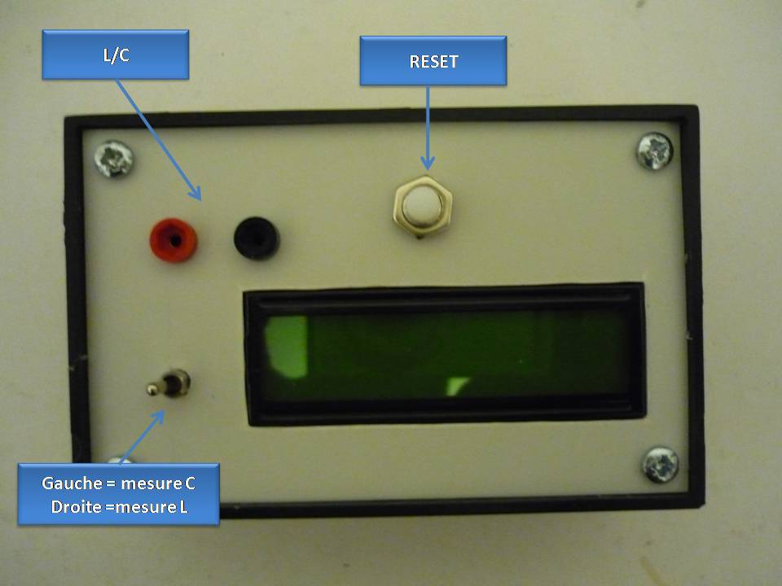

## 01/08/2011

- Le lecteur MP3 sait désormais jouer de la musique... J'ai écrit les quelques lignes pour piloter le STA013 (bus I2C pour la commande, bus SPI pour les données) et ai rajouté l'amplificateur pour écouteur (TDA1308).
- Ca fonctionne relativement bien, mais il me reste deux problèmes à résoudre : il y a des "crachouillis" (ressemblant un peu à ce que l'on entend sur un vieux 45 tours) et, surtout, l'horloge à 14.7456 Mhz cesse d'osciller au bout d'un quart d'heure. J'ai changé les capas (22pf à 15pf à 47pf) et rien n'y fait. Peut-être me faudrait-il changer le quartz... Je vais tenter de le remplacer par un quartz à 10Mhz (en changeant le fichier de configuration du STA013).
- Voici quelques photos de la chose à la date d'aujourd'hui :

 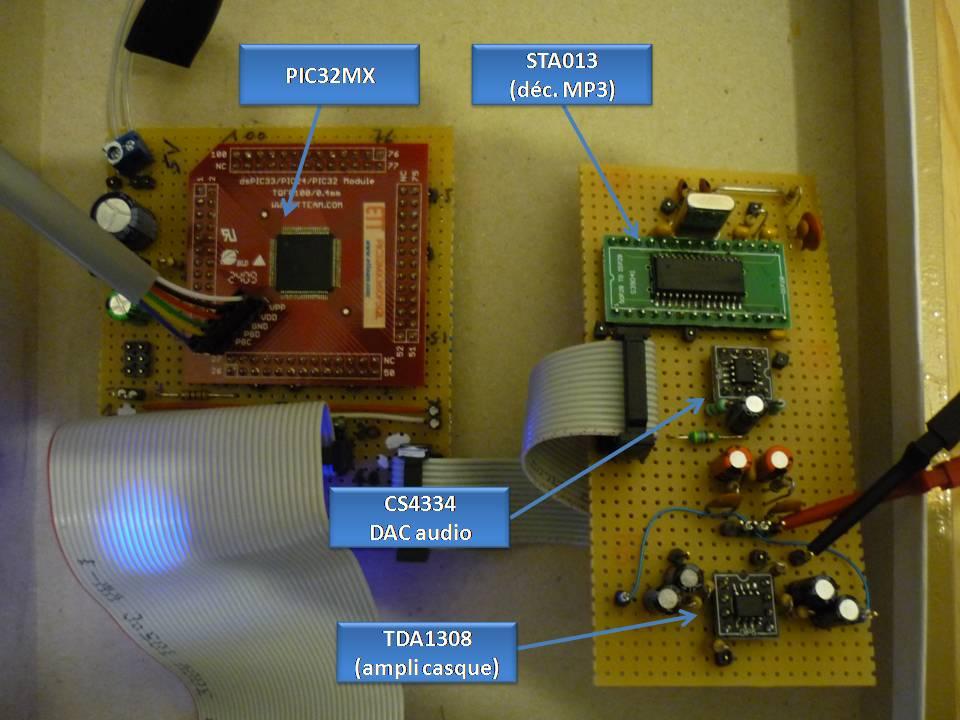
  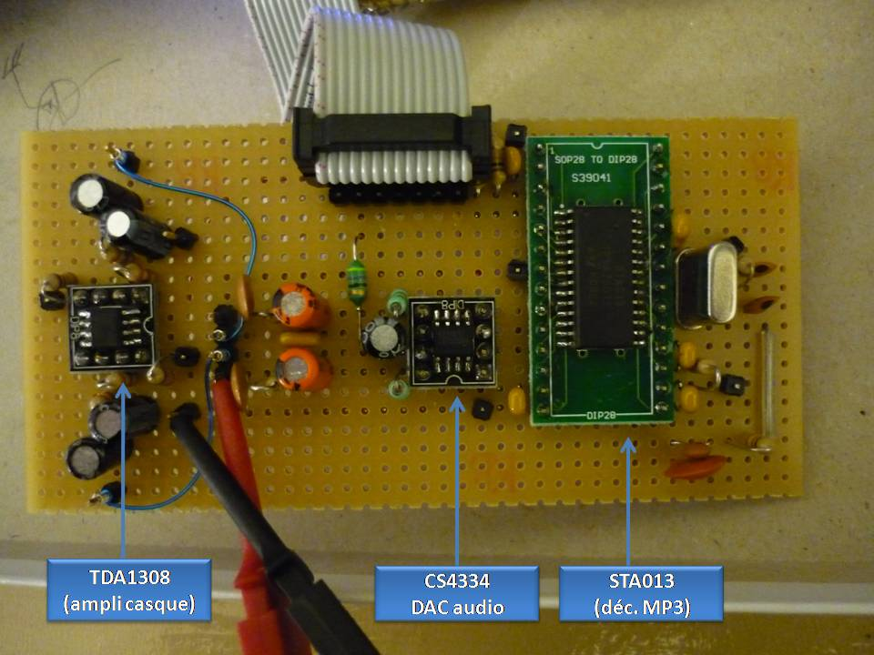

- Il me reste donc à corriger ces problèmes et à rajouter la radio.
- J'ai réalisé une petite alimentation +/-12V et +/-5V dont la sortie est une prise DIN à 5 broches. Désormais, je vais m'arranger pour que tous mes montages utilisent cette prise. En voila une photo : 

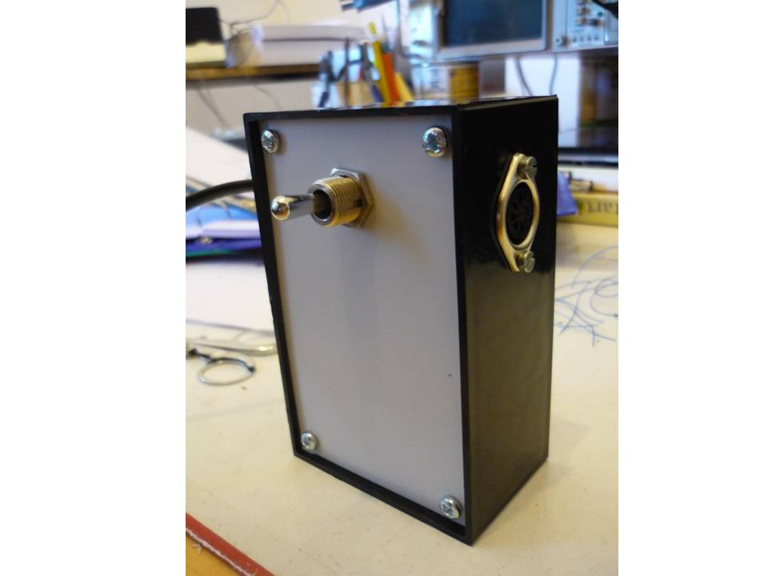

## 24/07/2011

- J'ai achevé l'électronique de décompression MP3 (ST013). Il ne reste plus qu'à réaliser le logiciel de contrôle...

## 23/07/2011

- J'ai achevé de mettre en place le ''minimum minimorum'' de mon [[lecteur MP3 à base de PIC32MX]], à savoir : la capacité de me déplacer dans le système de fichier contenu dans la SDCARD et de sélectionner un fichier. Le "clic" sur un fichier transmet un message à la tâche chargée de la transmission de son contenu vers le décodeur hard ST013.
- J'ai donc attaqué la réalisation de la carte comportant le ST013 et son DAC. Je n'intégrerait la radio FM et l'ampli de sortie qu'une fois la première partie validée...

## 18/07/2011

- Je suis parvenu (plutôt laborieusement en vérité) à utiliser l'AD7943, qui est le contrôleur de l'écran tactile de mon (futur) [[lecteur MP3 à base de PIC32MX]]. Je me suis embêté à vouloir utiliser les interruptions pour détecter l'appui sur l'écran, pour finalement terminer sur une bonne et brave boucle...
- J'ai réalisé une petite IHM pour calibrer le machin. En effet, en l'absence de calibration, si tout se passe bien sur l'axe des x, il y a un décalage notable sur l'axe des y...
- Prochaine étape : permettre à l'utilisateur de se déplacer dans l'arborescence des fichier de la SDCARD. Pour l'instant, il ne peut voir que les premiers fichiers situés à la racine.
- J'ai pris quelques notes concernant (notamment) [le filtrage analogique](http://dl.dropbox.com/u/30035647/auto.pdf).

## 16/07/2011

- Le [[générateur de fréquence à base de DDS AD9850]] est terminé. Disons plutôt que je m'en suis un peu débarrassé : si j'ai bien rajouté un ampli-op rapide en sortie (AD 811, qui chauffe énormément pour sa taille...), je n'ai pas rajouté de filtre faute de place. J'ai mis en tout dans un boitier (au chausse-pieds). Voici le résultat : 

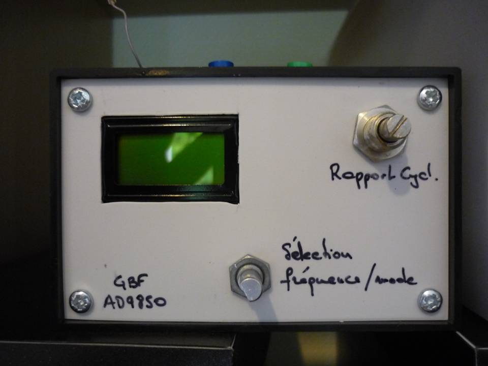.

- J'ai ajouté l'accès au contenu d'une carte SD à mon lecteur MP3. J'ai utilisé la bibliothèque FatFS et n'ai eu qu'à modifier trois bricoles de bas niveau (identification du bus SPI utilisé) pour que ça fonctionne. Voici, par exemple, le contenu d'une carte SD affiché sur l'écran : 

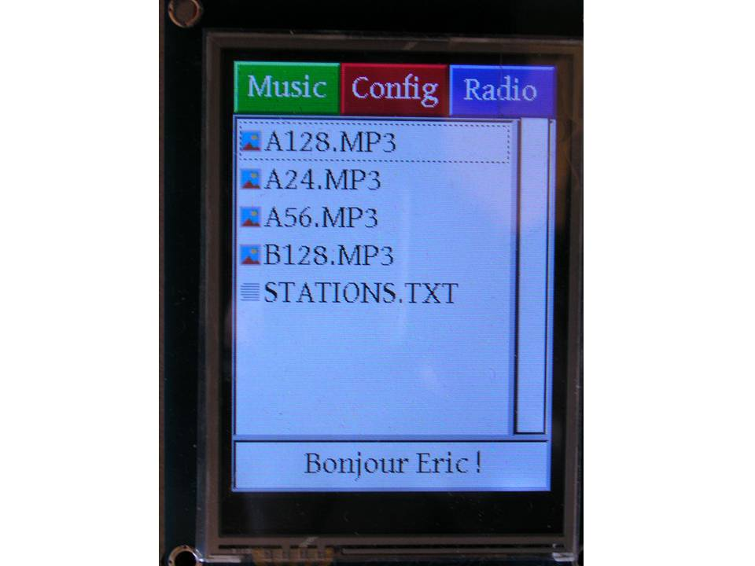.

- La prochaine étape va consister à utiliser l'écran tactile pour pouvoir naviguer dans la carte mémoire. Ceci fait, j'attaquerai alors la partie lecture MP3 proprement dite.

## 15/07/2011

- Voila, le [[générateur de fréquence à base de DDS AD9850]] est quasi achevé : j'ai réalisé la (toute petite) partie d'IHM qui manquait, c'est-à-dire la gestion de l'encodeur. Désormais, l'heureux utilisateur sélectionne la fréquence de son choix à l'aide d'un bouton : un clic et je passe en mode "sélection du digit à modifier", un autre clic et je passe en mode sélection de la valeur du digit. C'est-y-pas merveilleux?
- J'ai du vaguement bricoler pour calculer la consigne de fréquence à transmettre à l'AD9850 : consigne = frequence * 2^32 / 16.10^6... ce qui laisse pas mal de place aux débordements. Bon, je ne me suis pas trop fait de noeuds au cerveau du type 'et si je passais en division 64 bits". En vérité, je me contente de cadrer la fréquence le plus à gauche possible (je multiplie par 2^i), puis je fais la division (par 16.10^6 sans son multiple de 2, c'est à dire 2^10), et enfin je multiplie par 2^(32-10-i). C'est probablement pas optimal mais ça marchotte.
- Le signal en sortie n'est pas parfait : sa phase gigue bizarrement, ce qui provient peut-être de la mauvaise qualité de l'horloge. En outre, je n'ai pas encore placé de filtre en sortie.
- A propos de filtre, j'ai passé pas mal de temps à comprendre comment synthétiser le filtre Butterworth qui-va-bien. J'ai fait de sérieux progrès mais je suis obligé de replonger dans sujets qui me rajeunissent. On trouvera ici quelques notes sur le sujet des filtres. J'y aborde aussi l'utilisation de Matlab pour faire les calculs. Ca pourra (me) servir...

## 04/07/2011

- L'Ange a mis un certain temps à passer, la faute aux langages synchrones qui me préoccupent beaucoup ces derniers temps... Mais revenons à nos moutons électriques...
- En attendant l'arrivée du ST013 destiné à remplacer feu le VS1053b (''requiescat in pace''), j'ai réalisé un [[générateur de fréquence à base de DDS AD9850]].
- Il s'agit de mon troisième G(B)F, après le [[générateur BF à base d'XR2206]], le [[générateur de fonctions à base d'EPROM]] et le [[générateur BF à PLL, à base de PIC 16F628A]].
- L'AD9850 est un générateur type ''Direct Digital Synthesis'' (DDS), c'est-à-dire un composant qui génère un signal analogique (ici, une sinusoïde) à partir de sa version numérique stockée dans une ROM, d'un compteur, d'une horloge et d'un convertisseur numérique analogique.
- C'est exactement ce que j'avais fait dans le [[générateur de fonctions à base d'EPROM]], mais avec de bien modestes performances. L'AD9850 supporte quant à lui une fréquence d'entrée d'au plus 100MHz, ce qui lui permet de générer une sinusoïde à 50MHz!!!
- Pour ma part, je me suis limité à une horloge à 16Mhz ; vu la piètre qualité de mon montage (wrapping et plaque perforée), je ne pense pas pouvoir faire beaucoup mieux.
- L'AD9850 contient aussi un comparateur rapide qui permet de générer un signal rectangulaire de fréquence variable ; le rapport cyclique est choisi en changeant la valeur du seuil du comparateur.
- La fréquence de sortie est programmable par un microcontroleur, selon un mode parallèle ou série. Le mot de contrôle est de 40 bits, ce qui autorise une très grande précision.
- L'AD9850 est piloté par un PIC 16F628 qui a aussi en charge la gestion de l'écran et du codeur rotatif.
- Actuellement, le PIC génère une consigne de fréquence en triangle : montée et descente périodique de la fréquence de sortie.
- Il reste donc à réaliser la gestion de "l'IHM" (écran et codeur rotatif) et à rajouter un filtre pour éliminer les composantes de hautes fréquences liées au fait que le signal est échantilllonné (c'est-à-dire en "marches d'escalier").
- Je penche vers un filtre passif (vu les fréquences) de type Butterworth. Ce type de filtre a un profil parfaitement "plat" sur la zone située avant la férquence de coupure à -3dB. Il est en outre assez simple à comprendre... ce qui est en vérité le but de l'exercice.

## 29/06/2011

- Un ange passe...

## 18/06/2011
- Well, well... Après avoir réalisé la partie "décodeur MP3" à base de [VS1053b](http://www.vlsi.fi/uploads/media/vs1053.pdf), j'ai branché le tout et appliqué la procédure de vérification de VLSI Solution. Premier test : premier échec. La partie analogique ne fonctionne pas. Après vérification, il s'est avéré que les broches n'étaient pas convenablement soudées. Tentative de resoudage et échec. Finalement, j'ai découpé la plaquette pour supprimer la partie MP3. Je vais faire une nouvelle tentative avec le chip ST013 de STMicro et le convertisseur DAC CS4334 sur I2C de je-ne-sais-plus-qui. Je mettrais le tout sur une carte fille connectée par un HE10 à 10 fils (ça tombe bien, j'en ai...). Bref, c'est pas une réussite.
- Je commence à regarder comment réaliser un quadricoptère. Ca me permettrait de faire un peu d'autom. La partie mécanique n'est pas trop complexe (une plateforme en alu ou fibre de verre et quatre branches en fibre de carbone) ; les moteurs brushless ne sont pas trop onéreux, pas plus que les cartes de contrôle. A suivre...

## 04/06/2011
- J'ai commencé la réalisation d'un lecteur MP3/WMA sur la base du [VS1053b](http://www.vlsi.fi/uploads/media/vs1053.pdf) de VLSI Solution, d'un PIC32MX360F512 (512KB de flash, 32K de RAM) et d'un écran LCD couleur 240x320à contrôleur ILI9325. A la date d'aujourd'hui, je suis simplement parvenu à faire fonctionner le PIC sous FreeRTOS (OS que j'ai déjà utilisé pour le montage comportant une caméra vidéo et un ARM7), ainsi que l'écran couleur... après les quelques déboires habituels.
- J'ai tenté d'utiliser le mode PMP du PIC32 qui permet de générer automatiquement les signaux d'adresse, de donnée, de contrôle (RD, WR, ENB) utilisés lors de l'accès à un composant mémoire, par exemple. Bon, je ne suis pas parvenu à faire fonctionner l'écran ainsi, alors que les signaux semblent bien générés. Il s'agit (peut-être) d'un problème de vitesse (le PIC fonctionne à 80MHz, obtenu par multiplication de la fréquence de 8Mhz générée par un circuit RC interne). Finalement, je gère les différents signaux "à la main", ce qui n'est ni très élégant ni très efficace...
- J'utilise la bibliothèque graphique fournie par MicroChip. Elle ne demande que l'écriture de quelques lignes de code d'accès au matériel (driver). Je suis parti d'un code existant que j'ai adapté pour procéder à des accès sur 16 bits ; j'ai fait aussi quelques modifications des paramètres d'initialisation du chip pour "coller" au code qui m'a été fourni avec l'écran.

## 30/05/2011

- Le [[télémètre à ultrasons]] est achevé. J'ai rajouté un petit PIC 10F200 (8 broches) pour contrôler l'émission du top et "filtrer" l'écho. J'avais pour idée de transmettre la distance sous forme numérique. C'est faisable mais, pour l'instant, je me contente d'émettre un créneau dont la durée est proportionnelle à la distance. Voici une photo de la chose, une fois terminée :

 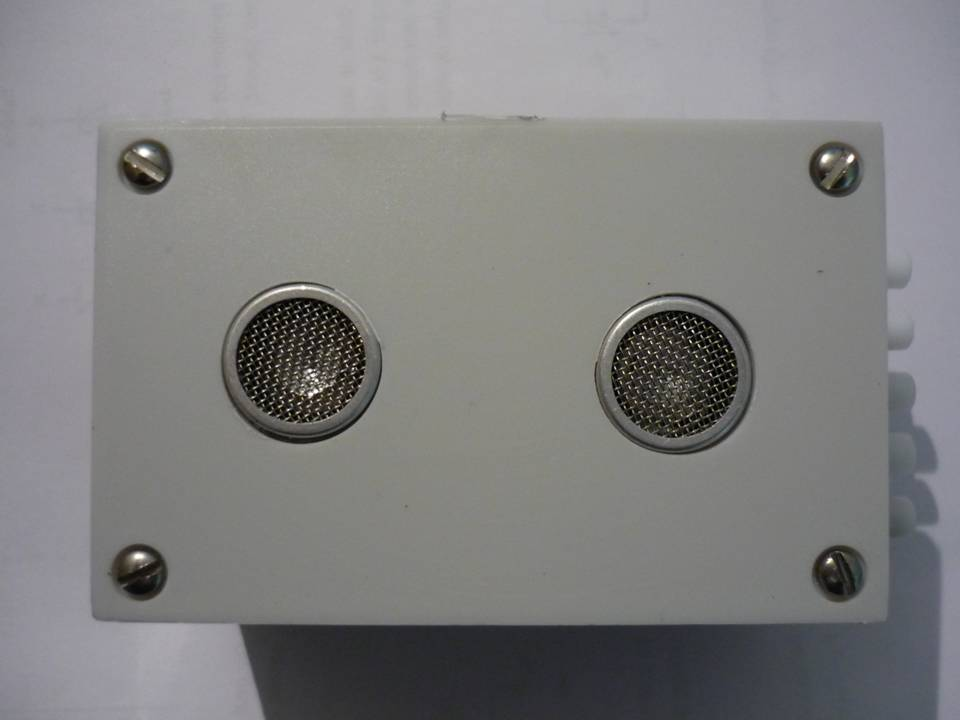

- A noter qu'il est important de réduire les fils de connexion du transducteur émetteur. Des fils trop longs (environ 20 cm), agissaient comme des antennes : je recevais un "pic" sur l'entrée (côté récepteur) même en l'absence de capteur. J'ai raccourci les fils et ai utilisé des fils blindés... ça marche beaucoup mieux...

## 21/05/2011

- J'ai abandonné l'idée d'utiliser une PLL (NE567) pour détecter l'écho dans mon [[télémètre à ultrasons]] : la PLL met un temps assez variable pour détecter le signal, ce qui induit une grande incertitude sur la mesure. En outre, un transducteur US constitue un filtre (mécanique) suffisant centré autour de sa fréquence de résonance (44Khz). Il n'est donc pas indispensable de rajouter un filtre hyper sélectif sur le signal après amplification.
- Aussi, je me contente désormais d'amplifier le signal reçu par le transducteur US, à y appliquer un seuil et un monostable. Le monostable n'est pas franchement indispensable dans la mesure où on utilise un microcontroleur.
- Le monostable est obtenu en rebouclant la sortie de l'ampli-op de seuil (inverseur) sur l'entrée non inverseuse. On trouvera le schéma complet dans la rubrique. On y trouvera aussi une petite vidéo explicative.
- J'ai décidé de m'essayer à la réalisation de petites vidéos explicatives. J'utilise Movie Maker de Microsoft, qui a le mérite d'être simple et rapide. J'ai essayé l'outil Cinerella sur Linux : c'est très puissant. L'IHM est inhabituelle (euphémisme) et la stabilité incertaine (comme d'habitude). Les aficionados de Linux expliqueront en long, large et en détails pourquoi ça marche beaucoup mieux que sous Windows, pourquoi c'est beaucoup plus stable, etc., etc. L'OS est stable, c'est sûr ; quant aux applications, c'est une autre affaire... or ce qui m'intéresse, ici, c'est l'application.
- J'ai aussi essayé Blender, qui propose aussi un moyen de "réaliser des films" à partir de diverses sources. Là, le problème n'est pas la stabilité, mais simplement la complexité : l'outil est excessivement riche et, pour ma part, je n'ai que des besoins modestes...

## 15/05/2011

- J'ai repris le [[télémètre à ultrasons]], l'un de mes premiers montages... L'émission du signal ultrasonore et la réception de son écho fonctionnent relativement bien.
- Je n'utilise pas de filtre en sortie de l'amplificateur (côté récepteur), mais un détecteur à base de PLL (NE567) de fréquence centrée sur 44KHz. On constate que ce détecteur introduit un retard non négligeable sur la réception de l'écho (voir les illustrations dans la rubrique). Ce retard n'est malheureusement pas constant : la PLL a parfois un peu de mal à "s'accrocher".
- Une solution plus simple pourrait consister à introduire un filtre passe bande centré sur 44KHz, à redresser sommairement le signal en sortie du redresseur et à l'appliquer à un comparateur. A essayer.

## 13/05/2011
- J'ai terminé la partie "numérique" du [[générateur BF à base d'XR2206]] : il est désormais capable d'afficher (une approximation de) la fréquence générée. En voici une photo :

 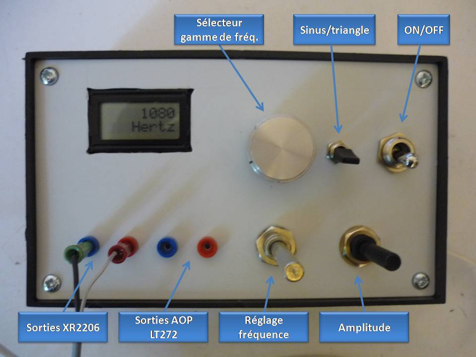

- J'ai du modifier légèrement la valeur des résistances utilisées pour le acquérir le signal d'indication de fréquence [+5v, -6.0v] produit par l'XR2206. J'explique en détail pourquoi dans la rubrique dédiée à ce générateur BF : en substance, il ne faut pas oublier qu'une diode est aussi une capacité...

## 08/05/2011
- J'ai mis en oeuvre mon [[générateur BF à base d'XR2206]] pour mesurer la valeur d'une inductance (ouawww! cf. cours de terminale...). Voir la section [[inductances]] où je narre cette bien belle histoire...
- Au passage, j'ai trouvé un chip assez intéressant pour faire un lecteur MP3/Ogg Vorbis/etc. Il s'agit du [VS1053b](http://www.vlsi.fi/uploads/media/vs1053.pdf) de VLSI Solution. Il prend un flux de données en entrées et s'occupe sagement du reste...

## 07/05/2011

- Un site intéressant sur les mathématiques : [metamath](http://us.metamath.org/mpegif/ax-1.html).

## 04/05/2011

- Le [[générateur BF à base d'XR2206]] est achevé du point de vue électronique : j'ai rajouté un PIC et un petit écran LCD pour afficher la fréquence générée. Il ne manque désormais qu'un petit bout de logiciel. La difficulté réside dans la largeur du spectre des fréquences à mesurer, qui court de 0 à 1MHz. Deux solutions :
  - Le signal rectangulaire de l'XR est utilisé pour déclencher / arrêter un timer. Cette solution est parfaite pour des fréquences pas trop élevées.
  - Le signal rectangulaire de l'XR est utilisé comme horloge d'un timer. Dans ce cas, la mesure de fréquence consiste à compter le nombre de "tics" entre deux instants (par exemple: 10ms). Cette solution est parfaite pour des fréquences élevées (car le compteur peut s'incrémenter un nombre significatif de fois entre les deux instants), mais est inefficace (imprécise) lorsque le signal varie très lentement car, la plupart du temps, le nombre d'impulsions entre les deux mesures va être égal à zéro.
- Une solution intermédiaire consiste à utiliser deux compteurs Ccal et C : l'un dont la source est calibrée de fréquence FC, l'autre dont la source est le signal dont on cherche la fréquence F. A chaque instant, une approximation de F est F#FC*CCal/C. Si on ne cherche pas une précision trop grande (et à mesurer une fréquence trop élevée), on peut prendre FC correspondant à l'exécution de la boucle qui incrémente CCal. On peut alors facilement faire varier FCal pour s'ajuster à la gamme de fréquence de F.
- J'ai commandé le petit [oscillateur](http://www.elemar.pl/pdf/CO19025.pdf) qui permettra de générer les 100MHz en entrée du DDS AD9850. J'ai rajouté un nouvelle rubrique sur ce [[Générateur de fréquence à base de DDS AD9850]].

## 30/04/2011

- Je viens de terminer le [[générateur BF à base d'XR2206]]. J'ai très bêtement suivi la note d'application d'Exar. Ca marche merveilleusement bien (après les habituels atermoiements liés aux soudures oubliées... fort heureusement le brave XR est robuste). J'ai rajouté un ampli-op de puissance (un L272, 0.7A) en sortie... sans trop de succès : le signal est assez bruité, malgré l'ajout d'une capacité de filtrage de 100nF en sortie et deux capacités de découplage sur les alimentations... Dans tous les cas, vu les performances de cet AOP (slew rate de 1V/us), la fréquence max. du GBF va être (très) réduite... Il faut utiliser un ampli-op rapide, tel l'AD818).
- La prochaine étape va consister à afficher la fréquence sur un petit écran LCD. Ca ne devrait pas être trop difficile dans la mesure où l'Exar, dans sa grande bonté, pilote une sortie à collecteur ouvert avec un signal carré de fréquence égale à celle de sa sortie principale.
- Au passage, j'ai rajouté une rubrique sur les [[inductances]]. Un composant un peu paradoxal car c'est probablement le seul que l'on puisse facilement réaliser, mais c'est aussi celui qu'on évite d'utiliser. On trouvera dans cette rubrique les différents codages utilisés sur les inductances, ainsi qu'un paragraphe sur la mesure d'une inductance ''avec les moyens du bord''.
- Je me suis mis à ocaml : un langage ''bien de chez nous'' qui est utilisé par nombre d'universitaires. On trouve de l'ocaml dans le générateur KCG d'Esterel, mais aussi dans le prouveur Coq, notamment. C'est un langage dans la lignée d'ML, comme son nom l'indique. Il comporte des traits des langages fonctionnels, procéduraux et objets. Un peu déroutant au début...

## 26/04/2011

- La version de base --- et probablement la seule à tout jamais...--- de la carte [[réveil à base d'Atmega32]] est achevée. Elle offre des fonctionnalités parfaitement extraordinaires telles diverses formes d'affichage de l'heure (hh:mm:ss et matrice de points), le réglage de l'heure et de la date et la consultation, activation, déactivation des alarmes. C'est merveilleux : tout un tas de fonctions que n'importe quel réveil à 5€ réalise fort bien et sans doute mieux. Mais je l'ai fait avec mes petits doigts et mon esprit gourds.
- Les mélodies des alarmes sont générées à partir de fichiers MIDI dont j'extrais simplement les événements "NOTE ON" (avec un vilain bout de Java). Je ne me soucie pas plus que d'une guigne de la durée des événements (durée entre "NOTE ON" et "NOTE OFF"), ce qui rend les mélodies particulièrement désagréables ce qui est, somme toute une bonne propriété pour un réveil.
- J'ai commencé à nettoyer un peu le code et à le commenter en utilisant doxygen (une forme de javadoc multi-langages).
- A faire :
  - Actuellement, les alarmes sont configurées par une constante dans le code... C'est très pratique : tout changement ou ajout d'une alarme requiert la modification et la recompilation du code ainsi que son re-flashage via la sonde ATMEL. L'interface USB-Série est bien là mais je ne l'utilise pas encore.
  - Assurer la continuité de l'aliementation du PCF8553 : ajouter une alimentation par pile (deux petites diodes plus un support de pile)
- Au passage, j'ai fait un tout petit petit petit montage assurant le déclenchement d'un ventilateur lorsque la température de consigne est dépassée : un ampli-op en comparateur, un transistor de commande du moteur, une diode et deux résistances. Si j'étais un peu plus compétent, je pense que j'aurais pu écraser la mouche sans ampli-op...  
- J'ai essayé de trouver une PLL en remplacement du 4046 de mon générateur-BF-qui-fonctionne-à-moitié. S'il fonctionne mal, c'est que je tente d'utiliser le VCO sur une largeur de 1MHz, ce que le pauvre animal ne sait pas faire. Bon, je n'ai rien trouvé pour l'instant, si ce n'est le synthétiseur [AD9850](http://www.analog.com/static/imported-files/data_sheets/AD9850.pdf) qui ferait exactement ce dont j'ai besoin si je le muni d'un diviseur (le bougre étant un peu rapide pour moi...).
- Je n'ai toujours pas commencé le générateur à base de XR2206... mais environ 1 million de bricoleurs géniaux l'ont fait avant moi : il n'y a donc pas urgence pour l'humanité.

## 17/04/2011

- La carte [[réveil à base d'Atmega32]] est désormais capable d'afficher des messages sur la matrice de LEDs. Bon, ça c'est pas très difficile.

 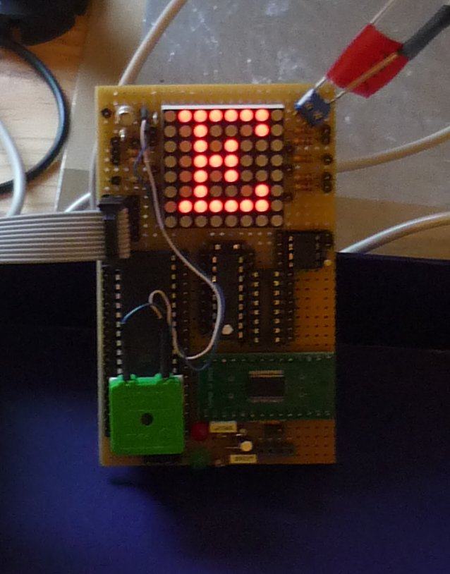

- Pour l'instant, le logiciel comporte trois "tâches" :
  - une tâche de rafraîchissement de l'écran de période 1ms,
  - une tâche d'affichage des messages, environ 50 fois plus lente,
  - une tâche de gestion des mélodies.
- Les tâches sont cadencées par une interruption timer (1ms). A chaque interruption, on parcourt une table contenant une liste de descripteurs (pointeur sur fonction, période, valeur du décompteur). Dès qu'un décompteur est nul, on appelle la fonction correspondante. En bref, c'est un ridicule ordonnanceur statique, bien pratique.
- Pour ce qui est des mélodies, on utilise un autre timer, de façon à éviter de monopoliser le CPU pour générer une fréquence.

## 11/04/2011

- La carte [[réveil à base d'Atmega32]] est achevée. Elle ne présente aucune difficulté particulière au niveau matériel. Par rapport à ce que je décrivais précédemment, j'ai supprimé le LS138 pour une bonne raison : ça marche pas... en effet, une lecture un peu attentive de la documentation du 138 (et surtout : un peu de bon sens) m'aurait permis de voir que les sortie du démux sont actives au niveau bas... ce qui se justifie, le 138 étant utilisé en général pour faire du décodage d'adresse, mais qui ne convient pas à l'utilisation que j'en fais. J'ai donc simplement supprimé le démux --- qui me permettait de n'utiliser que 3 sorties de l'Atmega pour piloter la colonne active --- et j'utilise bêtement 8 sorties pour les cathodes et 8 sorties pour les anodes (via l'ULN2803).
- Il me reste à réaliser le logiciel de pilotage de la chose, à savoir :
  - un séquenceur cyclique cadencé par un timer de l'ATMEGA
  - la tâche cyclique de rafraichissement de la matrice (8 octets correspondant aux 8 colonnes, une colonne est rafraichie par cycle)
  - la tâche cyclique de scrolling de l'affichage, afin de pouvoir afficher des messages un peu longs...
  - la tâche de contrôle du réveil (programamtion de l'IT du PCF8583)
  - la tâche de programmation et de réglage du réveil
  - une tâche d'animation de l'affichage
  - une tâche de génération de son (utilisant le deuxième timer...)

## 06/04/2011

- J'ai délaissé un peu le problème de la lecture des données en provenance de ma caméra (voir le précédent billet) pour bricoler un petit [[réveil à base d'Atmega32]]. Outre le microcontrôleur, la carte comprend une horloge temps-réel sur I2C, un FT232RL afin de pouvoir charger les heures de réveil à partir d'un PC, un buzzer, une horloge temps réel sur I2C (PCF 8583), et une matrice de LEDs (8x8) pilotée par le couple 74LS138+ULN2803 d'un côté et par le microtronrôleur de l'autre. L'ULN2803 me permet de drainer le courant des 8 LEDs d'une même ligne (soit environ 8x10mA=80mA). A la date d'aujourd'hui, les composants sont placés sur la carte et il reste à souder le tout... et à écrire le logiciel.
- Jeter un oeil sur le composant SAA7113H de NXP, qui permet de faire de l'acquisition vidéo... peut-être une voie intermédiaire entre la caméra numérique (type OV7670) et le couple caméra analogique + micro-contrôleur.

## 02/04/2011

- Pas de progrès phénoménaux, mais la carte à caméra OV7670 est désormais capable de transmettre une image vers un PC via une connexion Bluetooth. Curieusement, le coupleur BT installé sur la carte n'est reconnu par un PC disposant d'un coupleur BT que très rarement (pour tout dire, je n'y suis parvenu qu'une fois!). Aussi, pour contourner le problème, j'ai réalisé une petite carte comportant le coupleur BT et un FT252RL, mais ça, je l'ai déjà dit...
- La gestion de la ligne série côté ARM7 n'est pas difficile. Je n'utilise pour l'instant pas les interruptions... on verra plus tard.
- La lecture des données côté PC est plus laborieuse : j'utilise la "Java Communication API" et son implémentation pour Windows RXTX (dont on trouvera la FAQ, [ici](http://rxtx.qbang.org/wiki/index.php/FAQ)).
- J'ai acheté un XR2206 (6€) pour faire un petit générateur BF pas cher. On trouvera bientôt le montage dans la rubrique [[Générateur BF à XR2206]].
- J'ai commencé la réalisation d'un petit moniteur TR pour l'Atmega, à grand coup de setjmp / longjmp. Ca n'est pas bien compliqué, mais la gestion de la pile lors des commutation de tâches me laisse encore un peu perplexe... A creuser.
- J'ai rajouté une rubrique "[[poésies]]" (non pas que je sois grand amateur, loin s'en faut), mais certains poèmes sont de véritables soulagements...

## 27/03/2011

- Rien de bien neuf, la semaine ayant été laborieuse et le week-end sous aspirine. Néanmoins, j'ai réussi à faire la petite carte me permettant de connecter le coupleur Bluetooth à un PC via le bus USB. J'utilise le FT232 RL de FTDI, soudé au toaster. En voici la photo :

 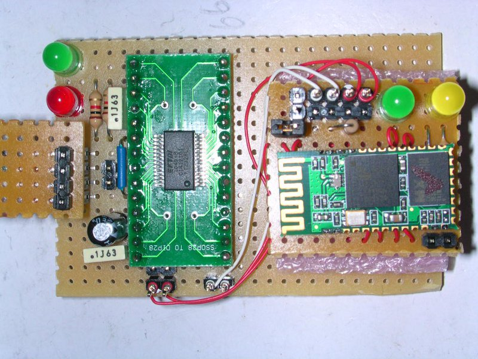

- Je vais bientôt pouvoir récupérer l'image de ma caméra sur un PC standard pour visualiser une image complète (640x480) avec un rendu correct des couleurs (l'écran Nokia - [[écrans LCD]] - n'est pas terrible de ce point de vue).

## 19/03/2011

- Alléluia! Ma caméra a enfin produit une image. la voila : 

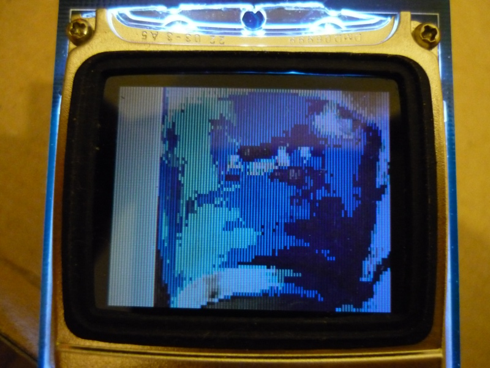 

qu'il faut comparer à l'objet filmé... 

- Ce (relatif) succès a été obtenu après quelques soucis essentiellement dus à ma mauvaise gestion des interruptions. En effet, le LPC1768 offre une gestion assez sophistiquée, bien éloignée de ce que j'avais jusqu'ici utilisé (Z80,...). Ainsi, lors de l'occurrence d'un front montant du signal VSYNC, une interruption de type EINT3 est levée. Pour que le processeur soit interrompu il faut activer la génération d'une IT sur front montant du signal, démasquer l'interruption EINT3 et activer les interruptions (et réciproquement pour inhiber l'interruption).
- Le résultat n'est pas génial... pour diverses raisons dont l'une ne m'appartient pas : la caméra est affublée d'un objectif de très faible profondeur de champ. Je devrais pouvoir réduire ce problème en mettant un diaphragme (un masque percé d'un trou) devant la lentille... à voir. En tout cas, je ne suis pas certain que je puisse distinguer proprement un point lumineux issu d'un laser.
- Les détails sur la carte de contrôle de la caméra se trouve dans la rubrique [[Caméra OV7670]].

## 18/03/2011

- Tremblement de terre, tsunami et catastrophe nucléaire imminente au Japon. Kadhafi s'accroche. Aristide revient. Tout va bien dirait Pangloss.
- Je n'arrive toujours pas à obtenir une image de ma caméra. Un petit passage sur analyseur logique m'a permis de comprendre l'une des raisons de cet échec (il y en a certainement d'autres à découvrir).
  - Je rappelle que j'utilise les fronts montant du signal VSYNC de la caméra pour réaliser l'acquisition d'une image.
  - Lorsque je veux acquérir une image, je réinitialise les pointeurs de la FIFO, je signale (dans la variable d'état du handler d'IT) que je souhaite faire une acquisition et, enfin, j'autorise les interruptions sur l'IT EINT3.
  - Lors du prochain front montant sur VSYNC, le signal WE est activé (ce qui va permettre l'écriture dans la FIFO, sachant que le signal WCLK est quant à lui toujours actif pour permettre le rafraîchissement de la DRAM de l'AL422), et la variable d'état est modifiée pour indiquer une acquisition en cours.
  - Lors du prochain front montant de VSYNC, l'acquision est arrêtée : le signal WE est désactivé et la variable d'état reprend la valeur correspondant à une attente.
  - De son côté la fonction appelée pour réaliser l'échantillonnage scrute cette variable et abandonne la scrutation dès qu'elle reprend la valeur correspondant à une attente (ce qui signifie la fin de l'échantillonnage). (Naturellement, ce schéma de scrutation sera remplacé par quelque chose d'un peu plus efficace basé sur les services de l'OS, mais c'est suffisant pour l'instant.)
  - Le problème réside dans le fait que VSYNC génère des fronts en permanence donc, dès que j'autorise les interruptions, je pars immédiatement dans le handler d'IT, de façon complètement asynchrone avec le signal VSYNC! La solution est simplement d'effacer le bit indiquant la présence d'une éventuelle (voire certaine) IT ''pending'' '''avant''' de libérer les interruptions! C'est effectivement évident, mais en l'absence de moyen de mesure / debug adapté, l'erreur est difficile à identifier...
  - Un petit schéma ci-après pour illustrer tout ça... 
  
  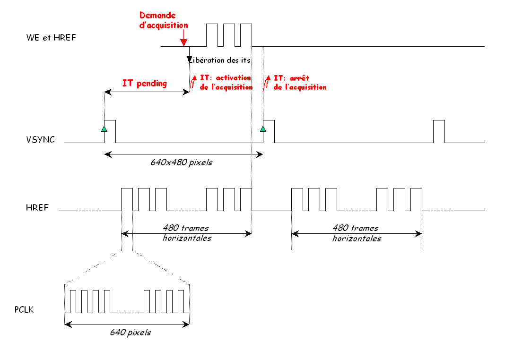

- J'ai rajouté des capas de découplage un peu partout... on ne sait jamais...

## 15/03/2011

- Les premiers essais d'affichage des données de la caméra ne sont pas concluants, loin s'en faut : l'image est parfaitement incohérente et même la relecture de la FIFO sans modification du contenu (et après réinitialisation du pointeur de lecture) ne donne pas une "image" stable... [Edit au 18/03: il s'agissait d'un problème de câblage : le signal WE était activé inopinément...]
- Si on fait l'hypothèse que le chip n'est pas défaillant, la seule bonne raison pour que le contenu "varie" lors de deux lectures successives est que le contenu a '''effectivement''' changé entre ces deux lectures, et la seule bonne raison pour qu'il ait changé sans opération d'écriture est que le rafraichissement n'ait pas été assuré.
  - En ragardant mon schéma, je m'aperçois que le signal WCLK, qui est utilisé (dans mon cas) pour assurer le rafraichissement de la DRAM de la FIFO n'a pas toujours une fréquence supérieure ou égale à 2MHz (voir notice du composant) puisqu'il est obtenu par un ET entre PCLK et HREF. Tout va bien lorsque HREF est à l'état haut (transmission des pixels d'une ligne), mais que ce passe-t-il lorsqu'il passe à l'état bas entre deux lignes?
- La correction consiste à connecter directement PCLK sur WCLK (ce qui assure une horloge constante pour le rafraichissement) et à contrôler l'écriture à l'aide de WE (comme cela est d'ailleurs clairement dit dans la notice). Le signal WE de la mémoire est obtenu par un ET entre HREF et un signal WEc (positif) issu du microcontrôleur, suivi d'une inversion : WE = non (HREF et WEc). A suivre...

## 14/03/2011

- J'ai intégré la mémoire FIFO (Avermedia) sur la carte d'acquisition vidéo. Pour l'instant, je ne peux afficher l'image aussi ne suis-je donc pas certain que le stockage se passe parfaitement, mais ce que j'observe à l'oscilloscope est de bonne augure.
- J'ai réalisé les 4 lignes de code qui permettent de capturer '''une''' image : j'utilise le signal de début de trame ('''frame''') pour générer une interruption sur le LPC1768 ; la routine d'interruption correspondante vérifie l'état d'un indicateur positionné par la fonction de demande d'acquision d'image ; si cet indicateur est positionné, le signal d'autorisation d'écriture (WREN) est activé, ce qui permet le stockage des données dans la FIFO ; il est désactivé à la prochaine interruption.
- J'ai branché un petit écran Nokia 3510 sur la carte. J'ai écrit le driver qui permet de l'initialiser et d'afficher une chaîne de caractère. Il ne reste désormais plus qu'à l'utiliser pour afficher le contenu de la FIFO...
- Au passage : j'ai ajouté d'une section sur les [[écrans LCD]]. Pour l'instant, on y décrit que le Nokia 3510 utilisé sur la carte d'acquisition vidéo.

## 08/03/2011

- Après pas mal de déboires avec l'I2C sur LPC1768 (essentiellement du au non respect de la règle : "quand tu modifies une ligne de code, c'est pas parce que ça marchait avant que ça marchera après, surtout après avoir changé un "|" en "||"), je suis parvenu à faire sortir une trame I2C à la bête.
- Après m'être rendu compte que la caméra avait besoin d'un signal d'horloge externe (nommé XCLK), de fréquence 24MHz ; après avoir réalisé un petit [[oscillateur à 74HC04]] et branché le tout, la caméra daigne comprendre les commandes que je lui envoie. C'est un grand jour.
- La simple présence d'un signal d'horloge suffit à ce que la caméra génère un flot de données : la valeur de défaut des registres semble être cohérente.
- J'ai utilisé le driver Linux de l'OV7670 pour récupérer les valeurs de registre permettant une initialisation correcte. La séquence d'initialisation se déroule bien. Il reste à placer la mémoire de stockage...

## 04/03/2011

- La nouvelle carte, destinée à recevoir la caméra OV7670 prend forme. Elle dispose du connecteur permettant d’accueillir la carte LPC1768 nue. Elle comporte les deux alimentations, 2.8V (caméra) et 3.3V (logique), et trois petites LEDs.
- J'ai rencontré quelques difficultés à faire fonctionner cette carte avec ma configuration de la sonde JTAG (500KHz) et ma configuration de l'horloge du LPC1768 (100MHz). J'ai réduit tout ça à des valeurs plus raisonnables (100KHz, et 40MHz). Ouf, ça fonctionne.
- Je débute les tests de l'I2C sur LPC1768 et l'OS FreeRTOS...

## 28/02/2011

- Ai rajouté la page ''[[A retenir]] pour collecter toutes les bonnes leçons dont il faut que je me souvienne pour éviter que mon cimetière de composants ne s'accroîsse dangereusement...

## 26/02/2011

- Kyrie Eleison! : j'ai enfin connecté la carte de commande de "puissance" des moteurs de Trobot1 le-bien-nommé avec la carte de contrôle (Atmega32). Le "radar" (c'est-à-dire le coupleur optique Sharp utilisé pour la mesure distance monté sur le moteur pas-à-pas) fonctionne, ainsi que tout le reste. Il s'agit maintenant d'écrire un peu de logiciel pour que la bête s'anime. Au passage, on s'aperçoit bien vite de l'intérêt d'un moniteur temps-réel...
- J'ai fait ma deuxième tentative de soudage d'un SSOP28 (toujours le même chip de FTDI). Un succès! Le "truc" : (i) utiliser le moins de soudure possible, quitte à enlever le surplus ; (ii) faire préchauffer le four. Je comprends maintenant pourquoi la pâte à souder est vendu en si petit conditionnement : j'en ai pour 10 ans. En une minute zou! la soudure est faite, et sans ponts intempestifs. Je peux désormais m'attaquer à du "lourd" : TQFP64 dont le "pitch" est le même que le SSOP28 : 0.8mm. (Mise à jour : en voulant tester le dit FTDI, je me suis trompé d'orientation (hum...). Bilan : un "doigt qui pique" (comme dirait Victor) et un FTDI qui fonctionne encore (robuste l'animal)... Les dégâts auraient pu être plus graves : un doigt brûlé, un FTDI brûlé et un PC brûlé.
- J'ai attaqué la carte destinée à contrôler la [[caméra OV7670]] : le support est réalisé ainsi que l'alimentation 3.3V et 2.8V. La leçon du jour : se souvenir qu'un régulateur qui n'est pas ''low-drop'' ne peut pas réguler si Vo = Vi - 0.5V !!!
- Je suis parvenu à connecter l'un de mes PC au coupleur Bluetooth embarqué, mais une seule fois... Il est impossible de parvenir à une connexion systématique, même avec le magnifique dongle Blutooth à 2€80 que j'ai déniché !

## 22/02/2011

- Ajout d'une page sur les [[coupleurs bluetooth BTM-5]]
- Ajout d'une page sur la [[caméra OV7670]] et son couplage à la FIFO AL422.

## 20/02/2011

- [[Urobot1]]est pratiquement opérationnel : les roues sont montées sur le "chassis" et une petite carte d'interface a été créée pour connecter les moteurs à la carte Arduino.
- J'ai essayé les cartes de communication Bluetooth : un demi-succès puisque si l'une des deux cartes fonctionne bien et s’appaire gentiment avec mon téléphone portable, l'autre ne donne aucun signe de vie.

## 15/02/2011

- Ajout d'une section concernant la génération de signaux PWM (ou MLI en français) dans la page sur l'[[Atmega32]].

## 14/02/2011

- La carte de contrôle de [[Trobot1]] est achevée et est connectée avec la carte de commande de puissance. Le code de génération des signaux PWM pour les moteurs (droit et gauche) fonctionne (10 lignes!). Il reste à finaliser la commande des moteurs pas-à-pas...
- Les servo-moteurs du robot sur base Arduino ont été modifiés et les supports de fixation sur le chassis ont été réalisés.
- J'ai commandé quelques dSPic 30F4011 ; ce type de microcontrôleur est un compromis, en terme de capacités, entre un Arm7 (qu'il est impossible de souder soi-même...) et un Atmega32.
- Création de la page sur [[Urobot1]], le robot de Frédéric.

## 02/02/2011

- Ajout d'un petit paragraphe sur les caméras... sur la page intitulée "[[Utilisation d'une caméra avec un microcontrôleur]]".

## 01/02/2011

- autoréférence car il s'agit de l'événement de création de la page "quoi de neuf".
