# Experiments in 2021 #
Experiments carried out in the past (from 2011) are described hereafter:
- [What's new 2020](whats_new_2020)
- [What's new 2019](whats_new_2020)
- [What's new 2018](whats_new_2020)
- [What's new 2017](whats_new_2020)
- [What's new 2016](whats_new_2020)
- [What's new 2015](whats_new_2020)
- [What's new 2014](whats_new_2020)
- [What's new 2013](whats_new_2020)
- [What's new 2012](whats_new_2020)
- [What's new 2011](whats_new_2020)


# December #
- In order to measure the current consumed by my BLE module, I have built a sub micro-Amp amp meter. I have used the setup proposed by [Crafty Coder](https://www.eevblog.com/forum/projects/nano-ammeter-project/), with a few modifications: a LCD display and an automatic range selection (using an Arduino pro micro). It works pretty well even though I cannot really estimate its precision. Nevertheless, it detects currents below 100nA. A picture is given below: 

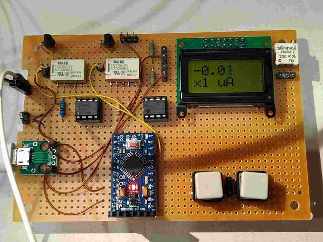

# November #
- I have developed a small board to detect door / window opening using Bluetooth BLE.  I use the good ol' nrf51822 with the Arduino IDE and [Sandeep Mistry's BlePeripheral library](https://github.com/sandeepmistry/arduino-nRF5).
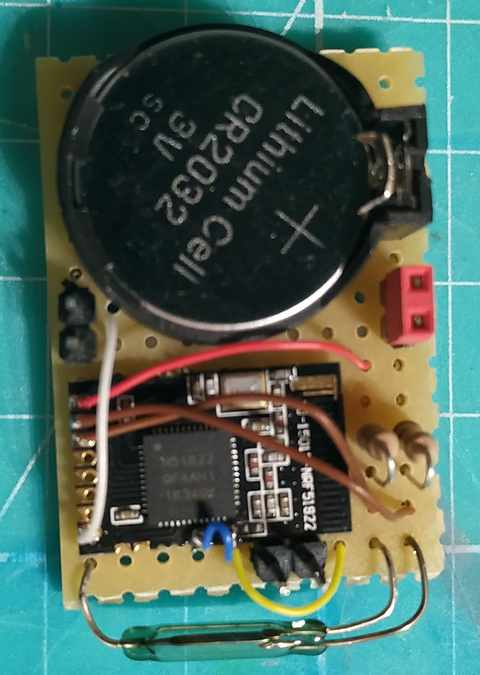

  -  I use an ESP32 as a BLE to MQTT gateway. The BLE device use the advertisement message to transmit the state of an magnetic switch. The device is always in low power mode except when the state of the switch changes (interrupt). The board is powered by a button cell (CR2032). In order to use the low power mode, I have followed the indications given by Jean-Matthieu Dechristé on [his blog](https://www.iot-experiments.com/nrf51822-and-ble400/ blog). I have also used his slightly modified version of S. Mistry's library in order to use interrupt with a low power consumption (see his blog for details). 


# October #
- Testing Raspberry Pi Compute Module 4 on IO board.
  - Download rpiboot utility to mount the eMMC (https://github.com/raspberrypi/usbboot)
  - Install linux using, e.g., BalenaEtcher
  - Create "ssh" file in "boot" to activate ssh
  - Add "dtoverlay=dwc2,dr_mode=host" in "config.txt" to activate USB 2.0 
  - Create "wp_supplicant.conf" file in "boot" to connect to activate Wifi (add an antenna too)
  ```
  ctrl_interface=DIR=/var/run/wpa_supplicant GROUP=netdev
  update_config=1
  country=FR
  network={
  	ssid="<SSID>"
    	psk="<PASSWD>"
  }
  ```

# September 2021 #
- I have continued playing with Home Assistant et al. 
  - I have added a "linky" sensor to my setup. 
  - The linky meter is a "smart" electrical meter deployed since a few years in France. Information can be found [here](https://particulier.edf.fr/en/home/contract-and-consumption/meter/linky-meter.html). 
  - This sensor is smart (which means "connected to the Internet") but, unfortunately Enedis provides no API to access the collected data (at least, not yet, and not for individuals). However, the linky meter is fitted with a so-called "TIC" serial interface, so I have implemented a TIC-to-LoRa box that sends the collected data to a Lora-to-MQTT interface module that finally makes the data available in HomeAssistant.
  - More information can be found in the [Linky dedicated page](linky.md). Here is a picture f the device: 

  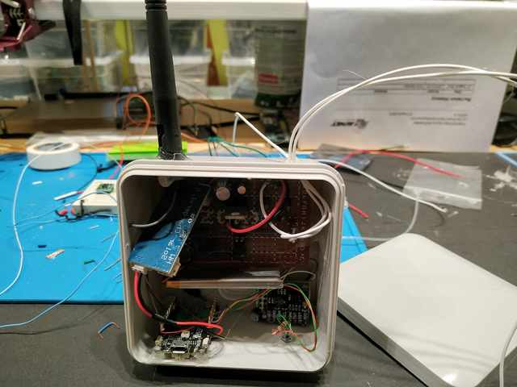

* Up to now, to create a new RF 433MHz device, I have used a 4-key remote controller module to generate the frames and teach my switches/keys. This is a bit annoying because it means that I have to buy a 4-key RC to integrate 4 new switches. In order to avoid that, I can simply use the rc-switch Arduino library to generate my own personal codes. So, I am going to build a universal RC 433Mhz remote controller with which I can create my own codes and tech my RC-key cloners and switches. This will be described in [[SonOff RF bridge with HomeAssistant]] dedicated page.

# August 2021 #
- I have continued playing with Home Assistant et al. 
  - I have built a Zigbee remotely controlable 2-relay device with a motion sensor. The device also plays the role of a Zigbee router. The heart of the device is a CC2530+CC2591 module programmed with the [PTVO firmware](https://ptvo.info):
  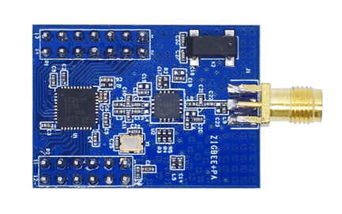
   
  - The motion sensor is a very cheap RCWL-0516:
    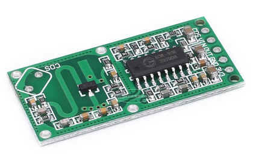  
    
  - The CC2530 is powered by a Hi-link 220V to 3.3 module. In order to have a better detection distance, the motion sensor is powered by a 5V source generated from the 3.3V source using an up converter.  
-  I have also implemented a display device using an ILI9341 display, a DFPlayer and a PAM8403 amplifier (to play pre-recorded messages). For the moment, the display shows the time of day, the temperature and the humidity level. The device is controlled by an ESP32 with the ESPHome firmware. 
** More details are available on the [Zigbee dedicated page](zigbee.md). 
- I have also installed a RF bridge based on SonOff's Rf bridge. Some information about this can be found in the [[SonOff RF bridge with HomeAssistant]] dedicated page. Thi sdevice allows cheap RF-controlled sensors and actuators to be integrated in the overall system. So, toay, I mix: Zigbee, Wifi, RF 433, LoRa communications... 

# July 2021 #

- Continuing playing with Zigbee. 
  - I have created a Zigbee device using a simple CC2530 board and a firmware generator for this device (if you want to develop your own firmware for the CC, you'll need to buy the compiler...).
  - I have installed "Home Assistant" and "zigbee2mqtt". Now, I would be able to control / automate a few things in my house, but I am not convinced that this is actually very useful...
- I have come back to my back scanner (first iteration in 2014 or so) in order to finish it. See the [Bat scanner dedicated page](bat_scanner.md).

# June 2021 #
- I am now playing with Zigbee devices. 
  - I have bought a CC2531 Zigbee sniffer, a small Sonoff bridge and a 4-relay zigbee board (all from AliExpress). Now,n I can control four relays using Amazon Alexa... As usual, interesting but completely useless... The next step is to setup my own home zigbee server using Zigbee2MQTT. 
  
  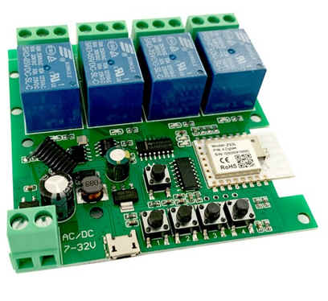  
  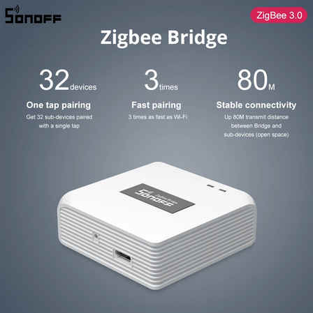
  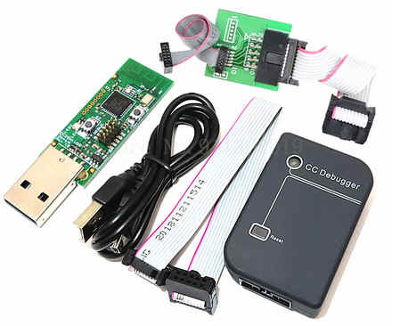

- To get the temperature of a Pi: 
  /opt/vc/bin/vcgencmd measure_temp

- I have built two small keyboards using at Atmega32U.

# May 2021 #
- Building a small custom keyboard using cheap Gateron switches and keycaps, and either an arduino or a bare Atmega (using the [VUsb library](https://www.obdev.at/products/vusb/download.html). See also the [LUFA library](http://www.fourwalledcubicle.com/LUFA.php).

- I have soldered 2 ESP-Link boards:

  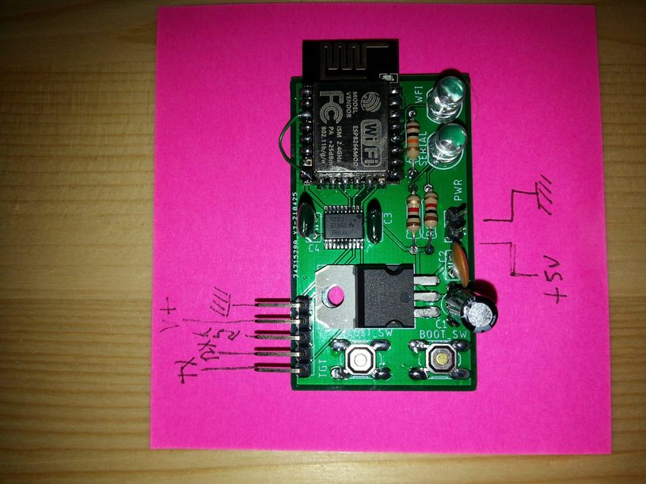

# April 2021 #

- I have setup a [esplink serial<=>wifi converter](https://github.com/jeelabs/esp-link). This very handy device, based on a ESP8266, allows an Arduino to be programmed remotely (without USB cable). 
  - After frying 3 ESP8266 due to bad breadboards (and my own stupidity), I have built a small board using my usual combination of solder bridges and wrapping.
  
  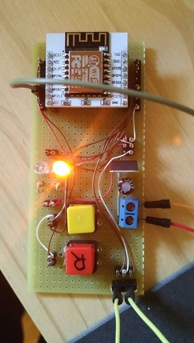

  - I have added a level converter (a YF08E), connected an 5V Arduino pro mini on one side, my board on the other side and, voila!, I can now upload software to the Arduino wirelessly... I have put information and links on a [[esp-link|dedicated page]]. Now, I will build a small PCB to make it more handy.
* I have put my [[CubeCell]] meteo sensor in a box, added battery control. For the moment the power consumption is much too high. With a supposedly 550mAh battery, the device works for around 24h.
** I guess that this is due to the sensor being powered on permanently. One solution would consist in powerin the sensor via a GPIO, but as my board is fitted with multiple sensors, I am dreading the current being drawn being too high. I'll check and, if it is too high, I'll simply add a FET transistor to control the sensor's power. 

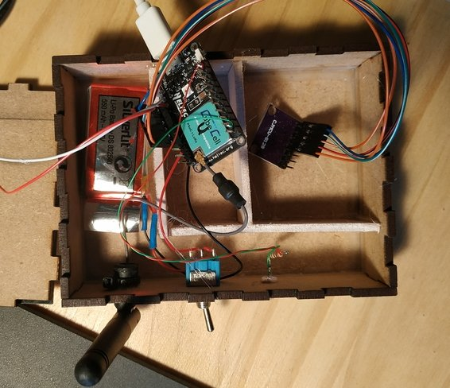

- I have implemented a minimalistic game using my galvo:


# March 2021 #
- 2021/03/07
  -  I have resurrected my galvo project. This is a long story. More information can be found on the [Galvo dedicated page](galvo.md).


# February 2021 #

* 2021/02/21 
  - The refresh rate of my CRT was much too slow and one could see the display refresh even with 5 characters displayed. So I built a 8-bit DAC using a R2R resistor ladder in order to avoid the I2C latency of the MCP:
  
  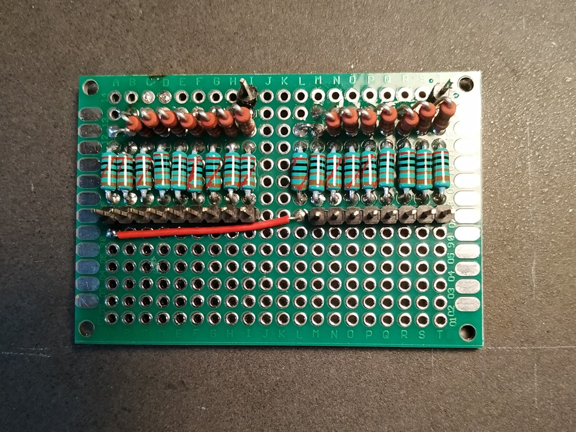

  - But the Arduino was in any case a bit too slow and has too few output pins. So I switched to an ESP32 (with two cores: one to refresh the display and the other to run some game...). And I discovered that the ESP32 has two DACs (connected to pin 25 and 26)! So I used the two internal DACs. ANd the result is much better. Now, I can display several lines of text without any flickering: 

  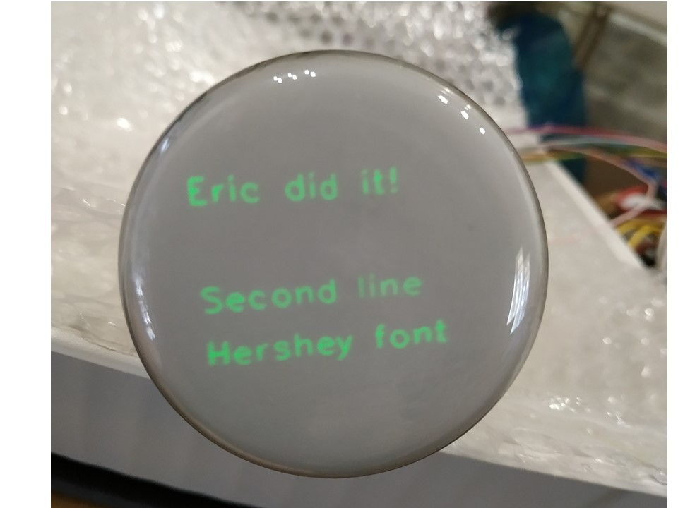


  - Now, I'll try to use it to implement some stupid game. 
  - There is a very bad [video (in french)](https://www.youtube.com/watch?v=2o2PSHlRo_I).

- 2021/02/20
  - I have managed to drive my CRT! To display text, I combined the Hershey's font definition provided at http://paulbourke.net/dataformats/hershey/ (slightly adapted), and the line plotting code from Alan Wolke (weaew).  First, I used an Arduino fitted with two MCP4725 DACs: 
  
  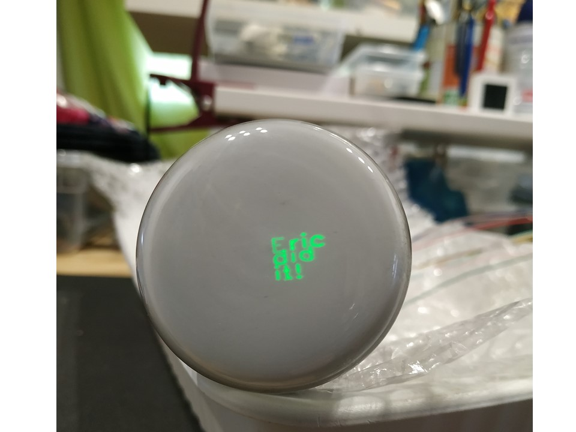

  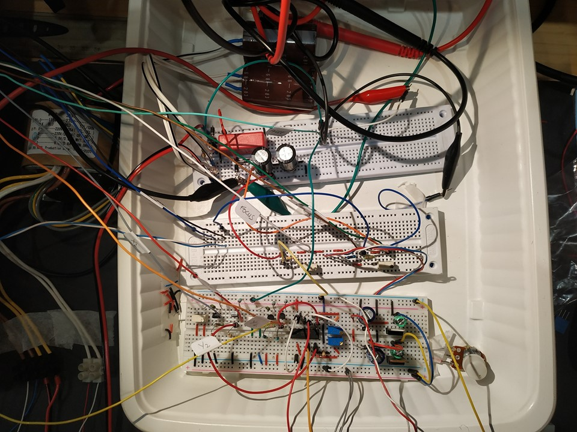

- 2021/02/14
  - I have received my russian CRT and have built the power supplies and the plate drivers. See article [[oscilloscope]]. Here are a few pictures of the current setup:

  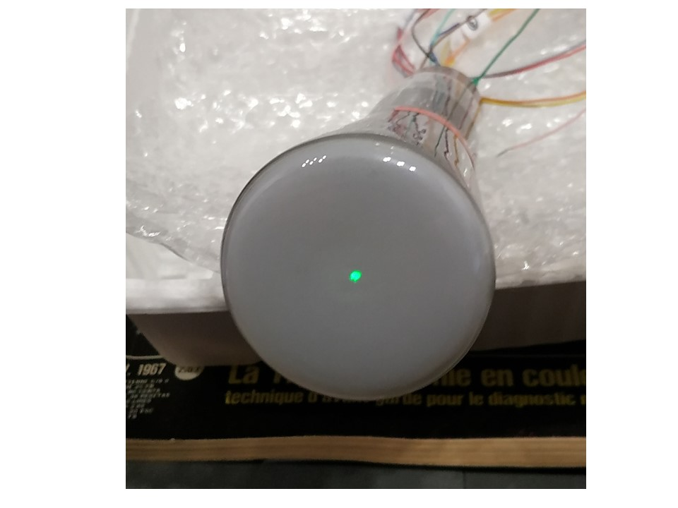
  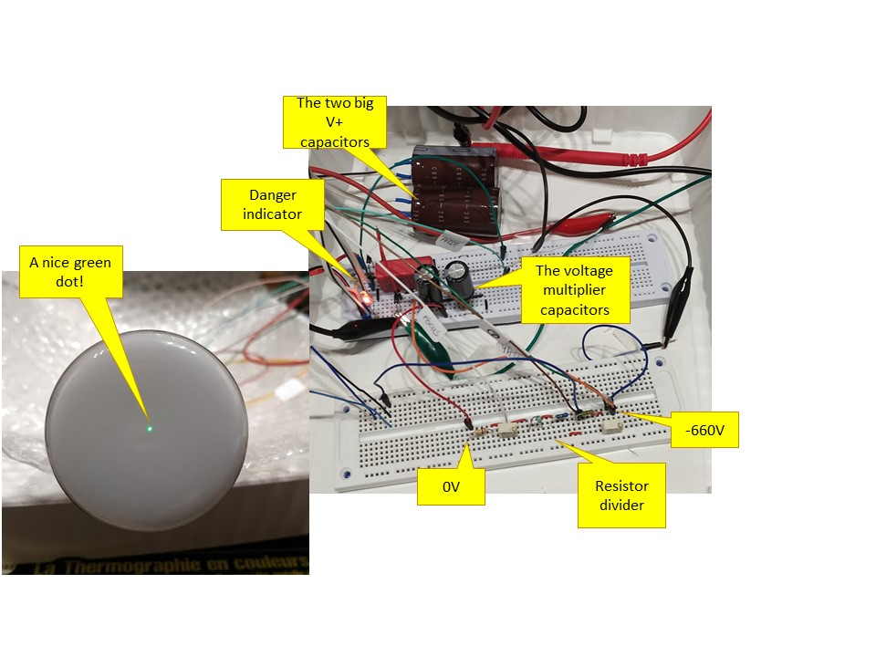

- I have completed my "sound spectrum analyser" using a BA3830 and a bunch of LM3914N. A video is available [https://www.youtube.com/watch?v=G8x3ySQlx2E here] (definitively non interesting). The PCBs have been built by JLPCB (nice and fast. A few pictures are at [[Sound spectrum analyzer]]. [[File:sound_spec_anal_live.jpg|400px|thumb|none]] 

- I have added a Python MQTT client to log the temp, humidity, pressure, etc. data to a mysql database. I use "sqlbrowser" to display the content of the data base. If I find some time, I'll write a Python HMI. Another solution would be to use an InfluxDb database (optimized for time series) and a Grafana dashboard. See this [tutorial](https://diyi0t.com/visualize-mqtt-data-with-influxdb-and-grafana/). I should also probably move to a more robust RPi distribution (e.g., dietpi) in order to prevent the nasty effect of power-cuts on the file system (dietpi allows to set parts of the file system read-only).

# January 2021 #

- I have moved my lab to a new, much larger, room: 
  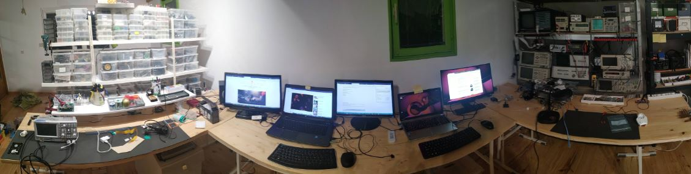

- Waiting for the transformer to drive a CRT (see  [[Quoi de neuf 2020]], december).

- I have created a LED "spectrum analyzer" using an electret microphone, a 5532 op amp:(see [here](http://www.michelterrier.fr/radiocol/detail2003/preamp-electret.htm#Antoine), a BA3830S spec. anal., and a [LM3914 LED display driver](https://www.ti.com/lit/ds/symlink/lm3914.pdf). Nothing very complicated, but just a way to occupy time. Here is the schematics:
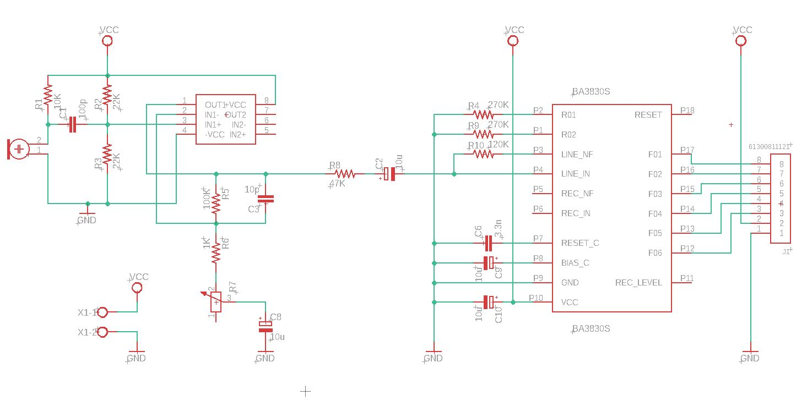
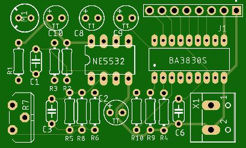
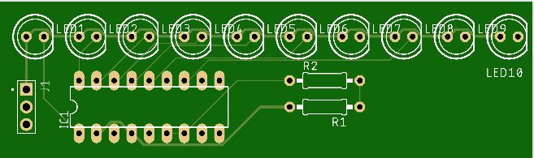

- I am also playng with my cubecell. I have attached a solar panel, a battery, and a CJMCU-8128 set of sensors. The guy transmits it data via LORA to a ESP32 which relays them to a MQTT Mosquitto server running on an RPi...